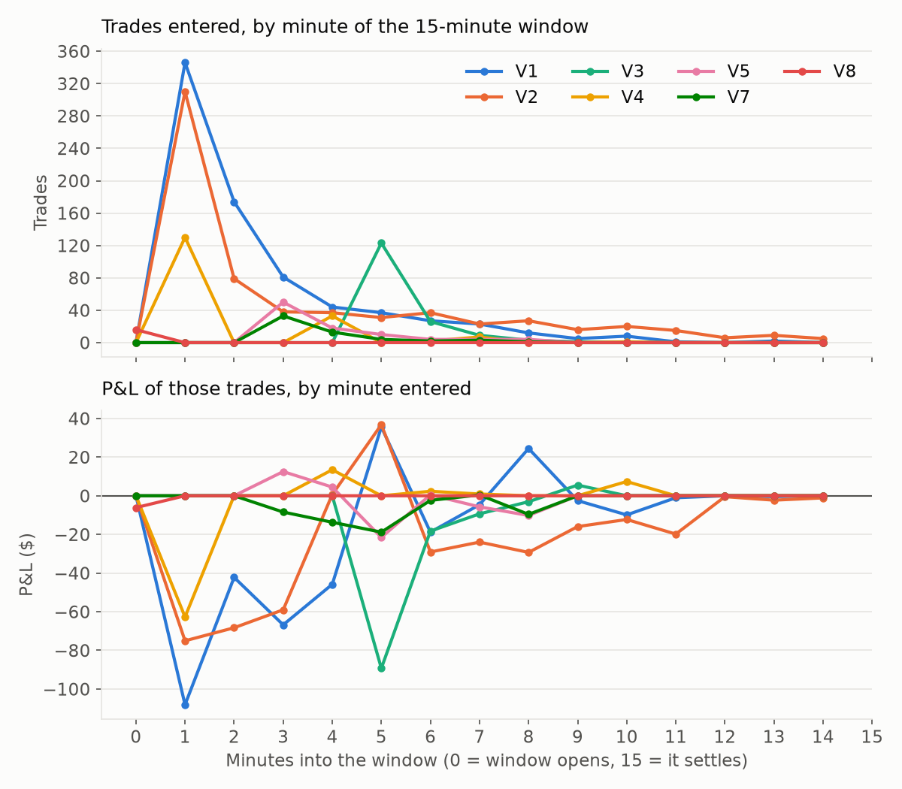
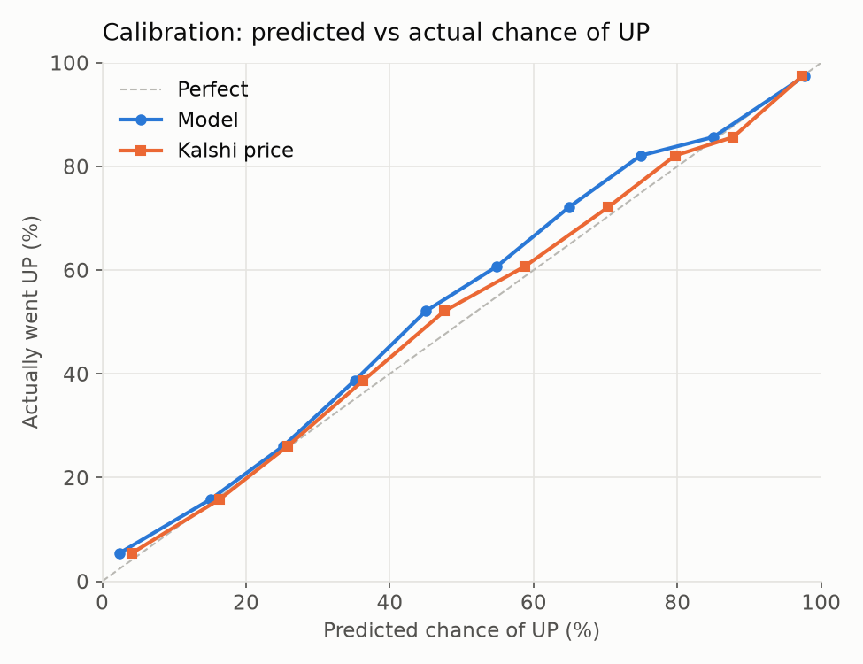
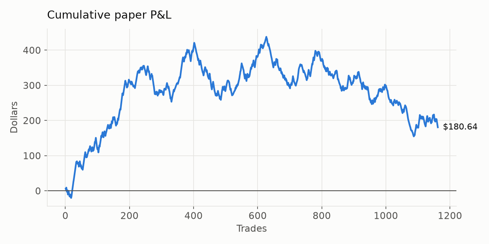

# Fair-Value Bot

*Updated Tue Sep 29, 8:06 AM MT. Paper money. Kalshi's 15-minute crypto up/down markets: every 2 seconds the bot works out the fair chance of UP from the live Coinbase price, the target price, time left and recent volatility, then buys whichever side is at least 4¢ cheaper than fair value after fees (10 contracts, held to the close).*

[← Back to all bots](README.md) · [Gold & Silver version](METALS.md)

## Current strategy

🟢 **Trade small.** Buying when the edge is **8¢+** made money in both halves of the data, and the model predicts better than Kalshi's prices.

1. **Every 2 seconds**, compute the fair chance of UP for each 15-minute crypto market.
2. **Buy** whichever side's price is at least **8¢ below** that fair chance after fees, priced 5¢–95¢, with 30 sec–14 min left. 10 contracts, one trade per window.
3. **Hold** to the close.

**Which edge threshold works best?** (replayed from the 30-second shadow log)

| Buy when edge is | Trades | P&L | Return | Earlier / later half |
|---|---|---|---|---|
| 2¢+ | 1191 | $38.31 | +1% | $145.19 / -$106.88 |
| 4¢+ ← live bot | 1148 | $257.48 | +5% | $217.22 / $40.26 |
| 6¢+ | 1055 | $297.07 | +7% | $242.96 / $54.11 |
| 8¢+ | 912 | $346.15 | +10% | $205.65 / $140.50 |
| 10¢+ | 775 | $290.52 | +10% | $163.45 / $127.07 |
| 15¢+ | 471 | $290.66 | +18% | $162.62 / $128.04 |

## Live bot results

| Trades | Settled | Won | Avg price paid | Model's avg chance | P&L | Return | Avg price move 3 min after buying |
|---|---|---|---|---|---|---|---|
| 1171 | 1162 | 550 (47%) | 44¢ | 53% | $180.64 | +3% | +5.3¢ |

*If the model is right, the win rate should land near the model's average chance, above the average price paid. "Price move 3 min after buying" shows whether the market moved toward the model's number soon after we bought — an early sign of real skill.*

## Versions head to head

*All four run side by side on the same markets, compared from when all of them were running (9/28 9:35 AM MT). 10 contracts per trade. From Sep 28 ~11:45 AM MT every buy is priced against Kalshi's live order book (earlier trades used the quoted price, which was often out of date).*

|  | What's different | Settled | Won | UP / DOWN | Trades per window | Worst window | P&L | Return |
|---|---|---|---|---|---|---|---|---|
| **V1** | Original (Coinbase price, 4¢ edge, no limit per window) | 760 | 324 (43%) | 241 / 519 | 8.5 | -$43.45 | -$240.27 | -7% |
| **V2** | Trend-aware, wider swings, 50/50 with Kalshi's price | 653 | 216 (33%) | 294 / 359 | 7.3 | -$55.90 | -$299.23 | -12% |
| **V3** | 5–10 min left only, 8¢+ edge, 3-exchange price, max 2 per window | 162 | 51 (31%) | 47 / 115 | 2.0 | -$14.97 | -$114.48 | -18% |
| **V4** | Limit orders 2¢ under the ask, 3-exchange price, max 2 per window · filled 75% of orders | 173 | 69 (40%) | 56 / 117 | 2.0 | -$13.69 | -$38.67 | -5% |
| **V5** | Trend Sniper: 6–12 min left, 25–55¢, 6¢+ edge, 1 bet per direction, take profit at 85¢ · *since it started* | 90 | 40 (44%) | 31 / 59 | 1.5 | -$10.05 | -$20.02 | -5% |
| **V7** | V5 signals through the risk-managed $500 account (2% bets, max 3 open, 25% peak stop) · *since it started* | 56 | 25 (45%) | 20 / 36 | 1.5 | -$20.08 | -$52.55 | -10% |
| **V8** | Trend Sniper on 1-hour markets: 20–45 min left, 25–55¢, 6¢+ edge · *since it started* | 16 | 6 (38%) | 6 / 10 | 1.6 | -$5.79 | -$6.13 | -9% |

*Model accuracy vs Kalshi's prices on the same 18,247 readings (excluding the final minute): V1 **+0.7%**, V2 **+1.2%**, 3-exchange price (V3/V4) **-0.7%**.*

*When in each window every version trades, and how those trades did. V3 only trades 5–10 minutes into the window by design.*

## Risk-managed account (V7)

🟢 **Trading**

| Started with | Equity now | Peak | Stop level | Open positions | Bet size |
|---|---|---|---|---|---|
| $500.00 | $447.46 | $525.36 | $394.02 | 2 of 3 | 2% of equity |

*Trades V5's signals with the safeguards a real-money bot needs: each bet risks at most 2% of the account, at most 3 positions open, never two bets the same direction in one window, and trading halts after a 25% drop from the peak (or below $350). Every buy and sell is double-checked against the ledger — a "sell" that spends money halts everything. Full log: [fv/account_ledger.csv](fv/account_ledger.csv).*

## Could we actually buy at that price?

| Trades checked | 10+ contracts available at our price | P&L (fillable trades only) | Return (fillable only) | Typical contracts available |
|---|---|---|---|---|
| 768 | 640 (83%) | -$223.87 | -8% | 220,459 |

*Checked against Kalshi's order book at the moment of each buy. If profits hold on fillable trades only, the paper results are realistic.*

## Does the model beat the market?

**✅ Yes** — accuracy vs Kalshi's prices: **+4.2%** over 30,404 readings from 1206 windows (log-loss skill; positive = model better).

| Model said UP | Readings | Model avg | Kalshi price avg | Actually UP |
|---|---|---|---|---|
| 0–10% | 5241 | 2% | 4% | 5% |
| 10–20% | 2380 | 15% | 16% | 16% |
| 20–30% | 2570 | 25% | 26% | 26% |
| 30–40% | 2807 | 35% | 36% | 39% |
| 40–50% | 2988 | 45% | 48% | 52% |
| 50–60% | 2985 | 55% | 59% | 61% |
| 60–70% | 2634 | 65% | 70% | 72% |
| 70–80% | 2171 | 75% | 80% | 82% |
| 80–90% | 1909 | 85% | 88% | 86% |
| 90–100% | 4719 | 98% | 97% | 97% |

*A well-calibrated model's 'Actually UP' matches its own average in every row.*

## By edge size

| Edge at buy | Trades | Won | Avg price paid | Model's avg chance | P&L | Return |
|---|---|---|---|---|---|---|
| 4–6¢ | 600 | 294 (49%) | 45¢ | 51% | $145.25 | +5% |
| 6–10¢ | 402 | 191 (48%) | 44¢ | 53% | $94.60 | +5% |
| 10–20¢ | 150 | 62 (41%) | 43¢ | 57% | -$48.98 | -7% |
| 20¢+ | 10 | 3 (30%) | 39¢ | 68% | -$10.23 | -25% |

*If bigger claimed edges don't do better, the model is overconfident.*

## By time left

| Time left | Trades | Won | Avg price paid | Model's avg chance | P&L | Return |
|---|---|---|---|---|---|---|
| 10–14 min | 1044 | 502 (48%) | 45¢ | 53% | $169.76 | +4% |
| 5–10 min | 107 | 43 (40%) | 37¢ | 46% | $22.22 | +5% |
| 2–5 min | 9 | 4 (44%) | 55¢ | 64% | -$10.94 | -21% |
| 1–2 min | 2 | 1 (50%) | 51¢ | 83% | -$0.40 | -4% |

## By price paid

| Price | Trades | Won | Avg price paid | Model's avg chance | P&L | Return |
|---|---|---|---|---|---|---|
| Underdog (5–25¢) | 150 | 30 (20%) | 18¢ | 27% | $6.60 | +2% |
| Toss-up (25–75¢) | 930 | 451 (48%) | 45¢ | 54% | $159.93 | +4% |
| Favorite (75–95¢) | 82 | 69 (84%) | 81¢ | 89% | $14.11 | +2% |

## By coin

| Coin | Trades | Won | Avg price paid | Model's avg chance | P&L | Return |
|---|---|---|---|---|---|---|
| BNB | 132 | 67 (51%) | 43¢ | 53% | $82.36 | +14% |
| XRP | 131 | 64 (49%) | 45¢ | 53% | $31.96 | +5% |
| ETH | 131 | 57 (44%) | 45¢ | 54% | -$42.96 | -7% |
| NEAR | 129 | 63 (49%) | 46¢ | 54% | $10.74 | +2% |
| HYPE | 129 | 55 (43%) | 43¢ | 52% | -$29.25 | -5% |
| SOL | 128 | 65 (51%) | 43¢ | 51% | $85.97 | +15% |
| DOGE | 128 | 57 (45%) | 43¢ | 52% | -$3.74 | -1% |
| ZEC | 127 | 55 (43%) | 41¢ | 50% | $13.43 | +3% |
| BTC | 127 | 67 (53%) | 49¢ | 57% | $32.13 | +5% |

## Latest trades

| When (MT) | Coin | Side | Time left | Paid | Model | Edge | Result | P&L |
|---|---|---|---|---|---|---|---|---|
| 9/29 8:03:44 AM | HYPE | DOWN | 11.3 min | 87¢ | 97% | 9¢ | Open | — |
| 9/29 8:03:44 AM | NEAR | DOWN | 11.3 min | 56¢ | 73% | 15¢ | Open | — |
| 9/29 8:03:02 AM | ZEC | DOWN | 11.9 min | 81¢ | 89% | 7¢ | Open | — |
| 9/29 8:02:47 AM | DOGE | DOWN | 12.2 min | 86¢ | 92% | 5¢ | Open | — |
| 9/29 8:02:47 AM | BNB | DOWN | 12.2 min | 87¢ | 93% | 5¢ | Open | — |
| 9/29 8:02:47 AM | BTC | DOWN | 12.2 min | 85¢ | 90% | 5¢ | Open | — |
| 9/29 8:02:12 AM | SOL | UP | 12.8 min | 40¢ | 51% | 9¢ | Open | — |
| 9/29 8:02:12 AM | XRP | UP | 12.8 min | 51¢ | 63% | 10¢ | Open | — |
| 9/29 8:01:24 AM | ETH | UP | 13.6 min | 66¢ | 75% | 8¢ | Open | — |
| 9/29 7:47:41 AM | ZEC | DOWN | 12.3 min | 54¢ | 61% | 5¢ | ❌ Lost | -$5.58 |
| 9/29 7:47:41 AM | BTC | DOWN | 12.3 min | 57¢ | 72% | 13¢ | ❌ Lost | -$5.88 |
| 9/29 7:47:41 AM | DOGE | DOWN | 12.3 min | 58¢ | 71% | 12¢ | ❌ Lost | -$5.94 |
| 9/29 7:47:41 AM | BNB | DOWN | 12.3 min | 56¢ | 71% | 13¢ | ❌ Lost | -$5.78 |
| 9/29 7:47:41 AM | HYPE | DOWN | 12.3 min | 47¢ | 63% | 15¢ | ✅ Won | $5.12 |
| 9/29 7:47:41 AM | ETH | DOWN | 12.3 min | 56¢ | 71% | 13¢ | ❌ Lost | -$5.78 |
| 9/29 7:47:41 AM | XRP | DOWN | 12.3 min | 52¢ | 68% | 14¢ | ✅ Won | $4.62 |
| 9/29 7:47:13 AM | SOL | DOWN | 12.8 min | 67¢ | 73% | 4¢ | ✅ Won | $3.14 |
| 9/29 7:46:46 AM | NEAR | DOWN | 13.2 min | 40¢ | 46% | 5¢ | ❌ Lost | -$4.17 |
| 9/29 7:32:12 AM | HYPE | DOWN | 12.8 min | 86¢ | 93% | 6¢ | ✅ Won | $1.31 |
| 9/29 7:31:58 AM | ZEC | DOWN | 13.0 min | 87¢ | 96% | 8¢ | ❌ Lost | -$8.78 |
| 9/29 7:31:58 AM | NEAR | DOWN | 13.0 min | 85¢ | 91% | 5¢ | ❌ Lost | -$8.59 |
| 9/29 7:31:58 AM | BNB | DOWN | 13.0 min | 82¢ | 94% | 10¢ | ✅ Won | $1.69 |
| 9/29 7:31:58 AM | ETH | DOWN | 13.0 min | 79¢ | 94% | 14¢ | ✅ Won | $1.98 |
| 9/29 7:31:43 AM | DOGE | UP | 13.3 min | 19¢ | 28% | 7¢ | ❌ Lost | -$2.01 |
| 9/29 7:31:43 AM | XRP | UP | 13.3 min | 32¢ | 48% | 14¢ | ✅ Won | $6.64 |

## How the model works

- **Fair chance of UP** = how likely the price is to finish at or above the target, assuming it moves randomly with the volatility of the last hour (weighted toward the last 15 minutes).
- **Final minute:** Kalshi settles on a 60-second average, so once that minute starts the bot averages its own price samples the same way and only models the part still to come.
- **Safety margins:** a small allowance for Coinbase vs Kalshi's index, a volatility floor, and no trades under 5¢ or over 95¢ where small model errors matter most.

## Raw data

- [fv/trades.csv](fv/trades.csv) — every paper trade
- `fv/obs/` — model vs market every 30 seconds for every market (shadow log)
- [fv/status.json](fv/status.json) — bot health
