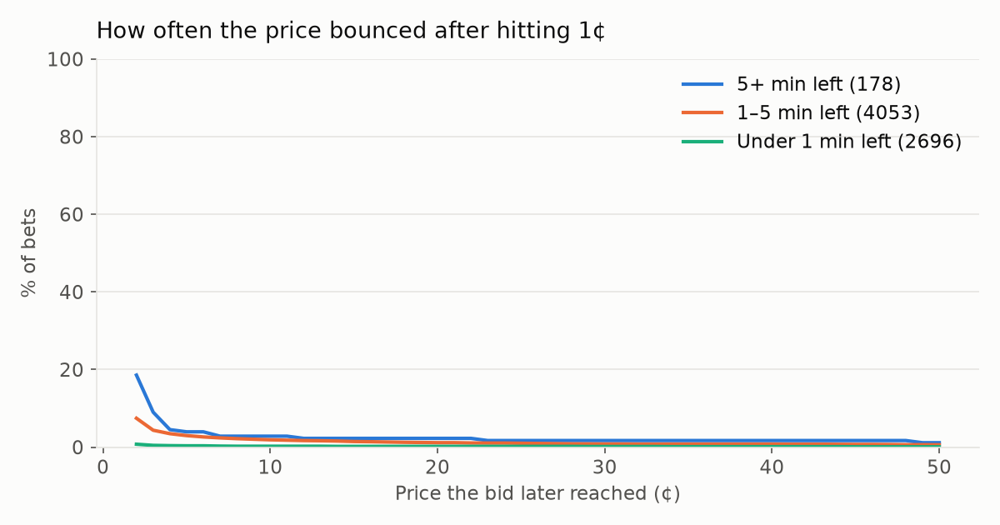
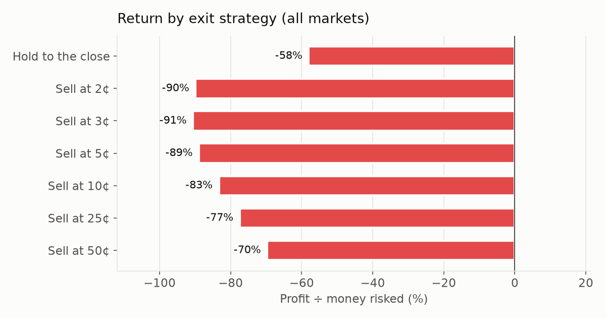
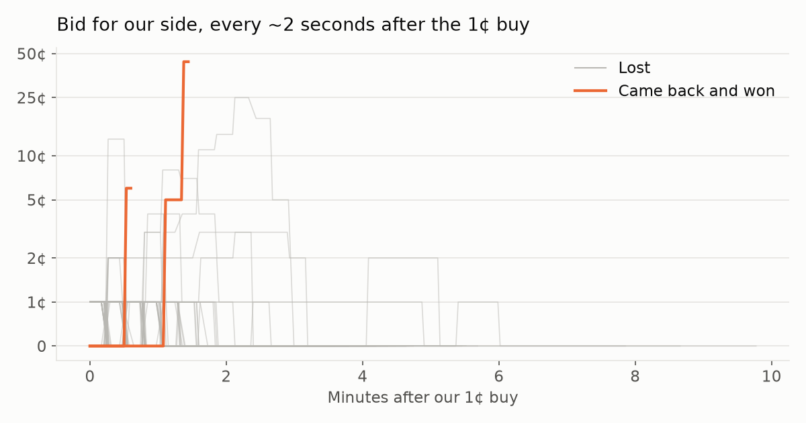

# 15-Minute 1¢ Study

*Updated Wed Sep 30, 11:58 PM MT. Paper money: every Kalshi 15-minute up/down market (crypto, currencies, commodities). Each time the UP or DOWN side hits 1¢ we buy 14 contracts (14¢ + 1¢ fee) and track that side's price every ~2 seconds until the window closes.*

[← Back to all bots](README.md) · [Sports 1¢ Study](STUDY.md)

## Current strategy

🟡 **Unproven.** Profitable overall, but not in both the earlier and later halves of the data.

1. **Watch** every 15-minute up/down market (5+ min left).
2. **Buy** the UP or DOWN side the moment it costs **1¢**: **14 contracts** with a 1¢ limit order (15¢ including the fee). One buy per side per window.
3. **Hold** until the 15 minutes are up. No selling.

| Rule | Based on | Hit rate | P&L (14 per buy) | Return | Avg per bet | Earlier half / later half |
|---|---|---|---|---|---|---|
| 5+ min left, hold to the close | 120 finished bets | 2% | $10.30 | +58% | +8.58¢ | $19.00 / -$8.70 |

*Expect about **38 buys a day** (~$5.74/day at risk); max loss per buy **15¢**.*

Runner-up rules

| Rule | Bets | P&L | Return |
|---|---|---|---|
| Momentum model ≥ 5%, hold to the close | 229 | $3.10 | +12% |
| Volatility model ≥ 5%, sell at 25¢ | 226 | -$0.82 | -3% |
| Volatility model ≥ 5%, sell at 10¢ | 226 | -$1.58 | -6% |

*Re-picked from the latest data every refresh, using only what's knowable at the moment of buying (market type, time left, price, model readings).*

## Headline

| 1¢ moments caught | Finished | Came back & won | Break-even win rate | Hold-to-close P&L | Best exit so far |
|---|---|---|---|---|---|
| 4000 | 3988 | 14 (0%) | 1.07% | -$290.90 (-60%) | Hold to the close: -$290.90 (-60%) |

*In play or awaiting result: 12. Commodity markets can take a few hours to settle.*

## Prediction models

*Each model's chance that our side wins, recorded at the moment we bought. Kalshi's price said about 1%. If a model knows better, only buying when it disagrees with the market should improve results.*

- **Volatility model:** random-walk (Black-Scholes) odds from the gap to the target, time left and the last hour's volatility
- **Momentum model:** same, but assumes the last 5 minutes' trend keeps going
- **Mean-reversion model:** same, but assumes the last 5 minutes' trend reverses

*Models cover the crypto markets (live prices from Coinbase). Readings start with the next watch session (about 12:45 AM MT, Sep 28).*

### How accurate is each model?

| Model | Bets scored | Avg chance it gave | Actual win rate | Accuracy vs market | Verdict |
|---|---|---|---|---|---|
| Volatility model | 2286 | 3.3% | 0.3% (6) | -565% | ❌ Worse |
| Momentum model | 2286 | 3.4% | 0.3% (6) | -610% | ❌ Worse |
| Mean-reversion model | 2286 | 6.4% | 0.3% (6) | -728% | ❌ Worse |

*Accuracy vs market compares the model's predictions with Kalshi's 1¢ price (log-loss skill). Positive = the model predicted outcomes better than the market.*

### Would the models have helped?

| Buy only when… | Bets | Won | Hold return | Sell@2¢ | Sell@3¢ | Sell@5¢ |
|---|---|---|---|---|---|---|
| **Any 1¢ (no model)** | 2286 | 6 | -67% | -84% | -85% | -82% |
| Volatility model ≥ 2% | 457 | 3 | -25% | -59% | -60% | -55% |
| Volatility model ≥ 5% | 226 | 1 | -43% | -22% | -23% | -17% |
| Volatility model ≥ 10% | 130 | 1 | +14% | +33% | +33% | +40% |
| Momentum model ≥ 2% | 403 | 2 | -41% | -54% | -57% | -54% |
| Momentum model ≥ 5% | 229 | 2 | +12% | -28% | -31% | -26% |
| Momentum model ≥ 10% | 151 | 1 | -3% | +8% | +11% | +15% |
| Mean-reversion model ≥ 2% | 859 | 3 | -63% | -85% | -87% | -83% |
| Mean-reversion model ≥ 5% | 565 | 3 | -43% | -82% | -84% | -77% |
| Mean-reversion model ≥ 10% | 360 | 2 | -38% | -77% | -80% | -73% |

*Compare each row with the first one: a model helps if its filtered bets earn more.*

## How high did the price bounce?

*Share of bets where the bid for our side later reached at least this much before the close.*

| Market type | Bets | ≥2¢ | ≥3¢ | ≥5¢ | ≥10¢ | ≥25¢ | ≥50¢ |
|---|---|---|---|---|---|---|---|
| Crypto | 2482 | 4% | 3% | 2% | 1% | 1% | 0% |
| Commodities | 1177 | 3% | 2% | 1% | 1% | 0% | 0% |
| Financials | 329 | 3% | 2% | 2% | 1% | 1% | 1% |
| **All** | 3988 | 4% | 2% | 2% | 1% | 1% | 0% |

## Exit strategies

*Sell the first time our side's bid reaches the target (after Kalshi's selling fee); otherwise hold to the close. Uses our 2-second snapshots, assuming a 14-contract sale fills.*

| Strategy | Hits | Hit rate | P&L | Return | Typical wait |
|---|---|---|---|---|---|
| Hold to the close | 14 | 0% | -$290.90 | -60% | — |
| Sell at 2¢ | 148 | 4% | -$434.42 | -89% | 47 sec |
| Sell at 3¢ | 90 | 2% | -$437.80 | -90% | 49 sec |
| Sell at 5¢ | 67 | 2% | -$429.35 | -88% | 66 sec |
| Sell at 10¢ | 48 | 1% | -$396.02 | -81% | 80 sec |
| Sell at 25¢ | 24 | 1% | -$379.46 | -78% | 1.6 min |
| Sell at 50¢ | 12 | 0% | -$349.90 | -72% | 2.0 min |

## By time left when it hit 1¢

| Time left in window | Bets | Won | ≥2¢ | ≥5¢ | Hold return | Sell@2¢ | Sell@3¢ |
|---|---|---|---|---|---|---|---|
| 5–10 min | 120 | 2 | 12% | 3% | +58% | -79% | -87% |
| 2–5 min | 1295 | 6 | 7% | 3% | -55% | -87% | -89% |
| 1–2 min | 1025 | 4 | 3% | 2% | -58% | -94% | -93% |
| Under 1 min | 1548 | 2 | 1% | 0% | -81% | -89% | -89% |

## By market

| Market | Bets | Won | ≥2¢ | ≥5¢ | Hold return | Sell@2¢ | Sell@3¢ |
|---|---|---|---|---|---|---|---|
| DOGE | 281 | 1 | 4% | 1% | -54% | -91% | -91% |
| NEAR | 277 | 0 | 5% | 1% | -100% | -89% | -91% |
| ETH | 277 | 2 | 5% | 3% | -11% | -88% | -86% |
| ZEC | 276 | 1 | 5% | 2% | -57% | -88% | -93% |
| XRP | 275 | 3 | 2% | 1% | +40% | -49% | -48% |
| HYPE | 275 | 1 | 5% | 3% | -56% | -89% | -88% |
| BNB | 275 | 0 | 4% | 1% | -100% | -91% | -94% |
| BTC | 274 | 0 | 7% | 3% | -100% | -85% | -87% |
| SOL | 272 | 0 | 3% | 1% | -100% | -92% | -92% |
| GOLD | 205 | 0 | 5% | 1% | -100% | -89% | -92% |
| SILVER | 189 | 0 | 2% | 1% | -100% | -96% | -96% |
| WTI | 181 | 1 | 3% | 1% | -42% | -94% | -95% |
| COPPER | 166 | 0 | 1% | 1% | -100% | -98% | -98% |
| NATGAS | 153 | 1 | 4% | 3% | -39% | -93% | -90% |
| PLATINUM | 144 | 0 | 0% | 0% | -100% | -100% | -100% |
| PALLADIUM | 139 | 0 | 2% | 1% | -100% | -96% | -98% |
| GBPUSD | 117 | 1 | 4% | 2% | -20% | -93% | -93% |
| EURUSD | 114 | 1 | 3% | 1% | -18% | -95% | -98% |
| USDJPY | 98 | 2 | 2% | 2% | +90% | -96% | -95% |

## UP vs DOWN

| Side | Bets | Won | ≥2¢ | ≥5¢ | Hold return | Sell@2¢ | Sell@3¢ |
|---|---|---|---|---|---|---|---|
| UP (bought YES) | 2032 | 8 | 4% | 2% | -55% | -92% | -92% |
| DOWN (bought NO) | 1956 | 6 | 4% | 2% | -65% | -86% | -87% |

## By how far price had to move (crypto)

*Distance between the coin's live price (Coinbase) and the window's target price when we bought.*

| Gap to target at buy | Bets | Won | ≥2¢ | ≥5¢ | Hold return | Sell@2¢ | Sell@3¢ |
|---|---|---|---|---|---|---|---|
| Under 0.05% | 285 | 1 | 1% | 1% | -32% | -27% | -27% |
| 0.05–0.1% | 347 | 0 | 1% | 0% | -100% | -96% | -97% |
| 0.1–0.2% | 599 | 1 | 4% | 2% | -78% | -90% | -91% |
| 0.2–0.5% | 840 | 2 | 6% | 3% | -74% | -88% | -89% |
| Over 0.5% | 410 | 4 | 7% | 3% | +1% | -87% | -89% |

## By time of day

| When (MT) | Bets | Won | ≥2¢ | ≥5¢ | Hold return | Sell@2¢ | Sell@3¢ |
|---|---|---|---|---|---|---|---|
| Night (12–6am MT) | 888 | 2 | 4% | 2% | -74% | -91% | -93% |
| Morning (6am–12pm) | 960 | 6 | 4% | 2% | -29% | -91% | -90% |
| Afternoon (12–6pm) | 841 | 2 | 3% | 1% | -73% | -80% | -84% |
| Evening (6pm–12am) | 1299 | 4 | 3% | 2% | -64% | -93% | -92% |

## Speed & liquidity

| Metric | Typical (median) |
|---|---|
| Our buy vs Kalshi's first 1¢ trade | 24 sec |
| Contracts traded at 1¢ after our buy (room to buy more) | 3,335 |
| Time from buy to best bounce (bounced bets) | 50 sec |
| Price snapshots per bet | 42 |

## Latest bets

| When (MT) | Market | Side | Time left | Gap | Peak bid | Result | Hold P&L |
|---|---|---|---|---|---|---|---|
| 9/30 11:58:39 PM | ETH | DOWN | 80 sec | +0.066% | — | In play | — |
| 9/30 11:58:39 PM | GBPUSD | UP | 80 sec | — | — | In play | — |
| 9/30 11:58:39 PM | HYPE | DOWN | 80 sec | +0.157% | — | In play | — |
| 9/30 11:58:23 PM | BTC | DOWN | 1.6 min | +0.070% | — | In play | — |
| 9/30 11:55:45 PM | BNB | DOWN | 4.2 min | +0.083% | — | In play | — |
| 9/30 11:55:12 PM | WTI | DOWN | 4.8 min | — | — | In play | — |
| 9/30 11:44:48 PM | SILVER | UP | 12 sec | — | 0¢ | ❌ Lost | -$0.15 |
| 9/30 11:44:32 PM | GBPUSD | DOWN | 28 sec | — | 0¢ | ❌ Lost | -$0.15 |
| 9/30 11:44:32 PM | ETH | DOWN | 28 sec | +0.034% | 0¢ | ❌ Lost | $0.00 |
| 9/30 11:44:32 PM | DOGE | DOWN | 28 sec | +0.013% | 0¢ | ❌ Lost | $0.00 |
| 9/30 11:44:32 PM | ZEC | DOWN | 28 sec | +0.008% | 0¢ | ❌ Lost | -$0.15 |
| 9/30 11:44:16 PM | EURUSD | DOWN | 44 sec | — | 0¢ | ❌ Lost | -$0.15 |
| 9/30 11:44:16 PM | BTC | UP | 44 sec | -0.068% | 0¢ | ❌ Lost | $0.00 |
| 9/30 11:43:26 PM | COPPER | DOWN | 1.6 min | — | 0¢ | ❌ Lost | -$0.15 |
| 9/30 11:43:10 PM | SOL | DOWN | 1.8 min | +0.169% | 1¢ | ❌ Lost | -$0.15 |
| 9/30 11:42:38 PM | NEAR | DOWN | 2.4 min | +0.407% | 1¢ | ❌ Lost | -$0.15 |
| 9/30 11:42:22 PM | HYPE | DOWN | 2.6 min | +0.216% | 0¢ | ❌ Lost | -$0.15 |
| 9/30 11:42:22 PM | WTI | DOWN | 2.6 min | — | 0¢ | ❌ Lost | $0.00 |
| 9/30 11:41:51 PM | XRP | DOWN | 3.1 min | +0.213% | 1¢ | ❌ Lost | -$0.15 |
| 9/30 11:41:33 PM | BNB | DOWN | 3.4 min | +0.075% | 2¢ | ❌ Lost | -$0.15 |
| 9/30 11:29:53 PM | COPPER | DOWN | 6 sec | — | 0¢ | ❌ Lost | -$0.15 |
| 9/30 11:29:37 PM | XRP | DOWN | 22 sec | +0.027% | 1¢ | ❌ Lost | -$0.15 |
| 9/30 11:29:37 PM | PALLADIUM | DOWN | 22 sec | — | 0¢ | ❌ Lost | -$0.15 |
| 9/30 11:29:37 PM | NEAR | DOWN | 22 sec | +0.083% | 0¢ | ❌ Lost | $0.00 |
| 9/30 11:29:37 PM | WTI | UP | 22 sec | — | 1¢ | ❌ Lost | -$0.15 |
| 9/30 11:29:21 PM | ETH | DOWN | 38 sec | +0.027% | 1¢ | ❌ Lost | -$0.15 |
| 9/30 11:29:21 PM | SILVER | DOWN | 38 sec | — | 0¢ | ❌ Lost | $0.00 |
| 9/30 11:29:21 PM | ZEC | UP | 38 sec | -0.168% | 1¢ | ❌ Lost | -$0.15 |
| 9/30 11:29:21 PM | HYPE | UP | 38 sec | -0.095% | 0¢ | ❌ Lost | -$0.15 |
| 9/30 11:29:05 PM | PLATINUM | DOWN | 55 sec | — | 0¢ | ❌ Lost | -$0.15 |

## Raw data

- [fifteen/bets.csv](fifteen/bets.csv) — one row per bet with every metric
- `fifteen/snaps/` — our ~2-second bid/ask snapshots for every open bet, one file per day
- `fifteen/ticks/` — every Kalshi trade in each market from 1 min before our buy to the close
- [fifteen/status.json](fifteen/status.json) — bot health
