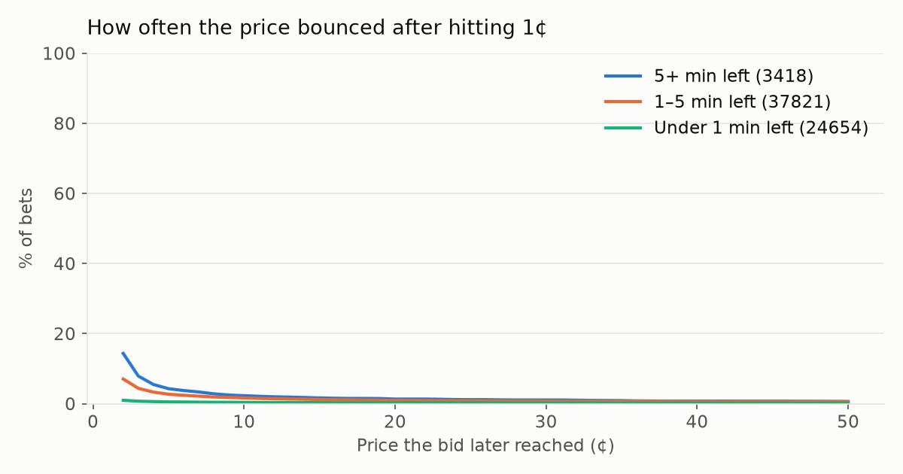

# 15-Minute 1¢ Study

*Updated Mon Nov 16, 3:10 AM MT. Paper money: every Kalshi 15-minute up/down market (crypto, currencies, commodities). Each time the UP or DOWN side hits 1¢ we buy 14 contracts (14¢ + 1¢ fee) and track that side's price every ~2 seconds until the window closes.*

[← Back to all bots](README.md) · [Sports 1¢ Study](STUDY.md)

## Current strategy

🟢 **Trade.** Profitable in both halves of the data over 100+ bets.

1. **Watch** every 15-minute up/down market (Volatility model ≥ 5%).
2. **Buy** the UP or DOWN side the moment it costs **1¢**: **14 contracts** with a 1¢ limit order (15¢ including the fee). One buy per side per window.
3. **Hold** until the 15 minutes are up. No selling.

| Rule | Based on | Hit rate | P&L (14 per buy) | Return | Avg per bet | Earlier half / later half |
|---|---|---|---|---|---|---|
| Volatility model ≥ 5%, hold to the close | 4420 finished bets | 1% | $224.40 | +46% | +5.08¢ | $86.10 / $138.30 |

*Expect about **90 buys a day** (~$13.49/day at risk); max loss per buy **15¢**.*

Runner-up rules

| Rule | Bets | P&L | Return |
|---|---|---|---|
| Momentum model ≥ 5%, hold to the close | 4170 | $122.80 | +27% |
| Volatility model ≥ 2%, hold to the close | 8228 | $87.55 | +9% |
| Momentum model ≥ 2%, hold to the close | 6842 | $12.15 | +2% |

*Re-picked from the latest data every refresh, using only what's knowable at the moment of buying (market type, time left, price, model readings).*

## Headline

| 1¢ moments caught | Finished | Came back & won | Break-even win rate | Hold-to-close P&L | Best exit so far |
|---|---|---|---|---|---|
| 58542 | 58517 | 227 (0%) | 1.07% | -$3,938.45 (-55%) | Hold to the close: -$3,938.45 (-55%) |

*In play or awaiting result: 13. Commodity markets can take a few hours to settle.*

## Prediction models

*Each model's chance that our side wins, recorded at the moment we bought. Kalshi's price said about 1%. If a model knows better, only buying when it disagrees with the market should improve results.*

- **Volatility model:** random-walk (Black-Scholes) odds from the gap to the target, time left and the last hour's volatility
- **Momentum model:** same, but assumes the last 5 minutes' trend keeps going
- **Mean-reversion model:** same, but assumes the last 5 minutes' trend reverses

*Models cover the crypto markets (live prices from Coinbase). Readings start with the next watch session (about 12:45 AM MT, Sep 28).*

### How accurate is each model?

| Model | Bets scored | Avg chance it gave | Actual win rate | Accuracy vs market | Verdict |
|---|---|---|---|---|---|
| Volatility model | 35291 | 4.6% | 0.4% (148) | -631% | ❌ Worse |
| Momentum model | 35291 | 4.5% | 0.4% (148) | -657% | ❌ Worse |
| Mean-reversion model | 35291 | 7.9% | 0.4% (148) | -767% | ❌ Worse |

*Accuracy vs market compares the model's predictions with Kalshi's 1¢ price (log-loss skill). Positive = the model predicted outcomes better than the market.*

### Would the models have helped?

| Buy only when… | Bets | Won | Hold return | Sell@2¢ | Sell@3¢ | Sell@5¢ |
|---|---|---|---|---|---|---|
| **Any 1¢ (no model)** | 35291 | 148 | -46% | -87% | -87% | -85% |
| Volatility model ≥ 2% | 8228 | 77 | +9% | -77% | -76% | -72% |
| Volatility model ≥ 5% | 4420 | 51 | +46% | -72% | -70% | -67% |
| Volatility model ≥ 10% | 2541 | 30 | +71% | -63% | -61% | -57% |
| Momentum model ≥ 2% | 6842 | 57 | +2% | -78% | -78% | -74% |
| Momentum model ≥ 5% | 4170 | 41 | +27% | -74% | -74% | -70% |
| Momentum model ≥ 10% | 2716 | 26 | +35% | -66% | -66% | -62% |
| Mean-reversion model ≥ 2% | 14451 | 103 | -22% | -82% | -82% | -80% |
| Mean-reversion model ≥ 5% | 10050 | 85 | -6% | -80% | -79% | -77% |
| Mean-reversion model ≥ 10% | 6664 | 61 | +4% | -77% | -77% | -74% |

*Compare each row with the first one: a model helps if its filtered bets earn more.*

## How high did the price bounce?

*Share of bets where the bid for our side later reached at least this much before the close.*

| Market type | Bets | ≥2¢ | ≥3¢ | ≥5¢ | ≥10¢ | ≥25¢ | ≥50¢ |
|---|---|---|---|---|---|---|---|
| Crypto | 35497 | 5% | 3% | 2% | 1% | 1% | 1% |
| Commodities | 13858 | 3% | 2% | 1% | 1% | 0% | 0% |
| Financials | 9162 | 2% | 2% | 1% | 1% | 0% | 0% |
| **All** | 58517 | 4% | 3% | 2% | 1% | 1% | 0% |

## Exit strategies

*Sell the first time our side's bid reaches the target (after Kalshi's selling fee); otherwise hold to the close. Uses our 2-second snapshots, assuming a 14-contract sale fills.*

| Strategy | Hits | Hit rate | P&L | Return | Typical wait |
|---|---|---|---|---|---|
| Hold to the close | 227 | 0% | -$3,938.45 | -55% | — |
| Sell at 2¢ | 2352 | 4% | -$6,210.93 | -87% | 47 sec |
| Sell at 3¢ | 1587 | 3% | -$6,203.52 | -87% | 48 sec |
| Sell at 5¢ | 1088 | 2% | -$6,087.25 | -86% | 62 sec |
| Sell at 10¢ | 665 | 1% | -$5,839.30 | -82% | 65 sec |
| Sell at 25¢ | 351 | 1% | -$5,422.64 | -76% | 80 sec |
| Sell at 50¢ | 234 | 0% | -$4,878.95 | -69% | 1.6 min |

## By time left when it hit 1¢

| Time left in window | Bets | Won | ≥2¢ | ≥5¢ | Hold return | Sell@2¢ | Sell@3¢ |
|---|---|---|---|---|---|---|---|
| Over 10 min | 13 | 0 | 31% | 23% | -100% | -47% | -20% |
| 5–10 min | 2929 | 13 | 11% | 4% | -58% | -81% | -82% |
| 2–5 min | 18923 | 104 | 7% | 3% | -46% | -87% | -87% |
| 1–2 min | 14753 | 51 | 3% | 2% | -61% | -92% | -92% |
| Under 1 min | 21899 | 59 | 1% | 0% | -61% | -85% | -85% |

## By market

| Market | Bets | Won | ≥2¢ | ≥5¢ | Hold return | Sell@2¢ | Sell@3¢ |
|---|---|---|---|---|---|---|---|
| ZEC | 3973 | 19 | 5% | 2% | -37% | -88% | -87% |
| SOL | 3968 | 18 | 4% | 2% | -42% | -86% | -86% |
| HYPE | 3962 | 12 | 4% | 2% | -62% | -89% | -88% |
| DOGE | 3952 | 11 | 4% | 2% | -65% | -90% | -89% |
| BNB | 3949 | 20 | 5% | 2% | -36% | -86% | -85% |
| ETH | 3940 | 17 | 6% | 3% | -46% | -82% | -82% |
| BTC | 3923 | 21 | 5% | 2% | -27% | -86% | -88% |
| NEAR | 3921 | 17 | 5% | 2% | -44% | -85% | -86% |
| XRP | 3909 | 15 | 3% | 2% | -52% | -89% | -88% |
| GOLD | 2073 | 5 | 5% | 2% | -70% | -83% | -84% |
| WTI | 2061 | 7 | 4% | 2% | -59% | -91% | -92% |
| SILVER | 2017 | 9 | 5% | 2% | -47% | -83% | -83% |
| PLATINUM | 1837 | 4 | 3% | 1% | -80% | -95% | -95% |
| EURUSD | 1785 | 6 | 2% | 1% | -69% | -90% | -90% |
| COPPER | 1721 | 6 | 2% | 1% | -67% | -75% | -75% |
| GBPUSD | 1709 | 6 | 2% | 1% | -67% | -96% | -96% |
| NATGAS | 1694 | 9 | 2% | 1% | -50% | -74% | -74% |
| USDJPY | 1672 | 6 | 2% | 1% | -67% | -97% | -96% |
| PALLADIUM | 1650 | 4 | 1% | 0% | -77% | -92% | -93% |
| AUDUSD | 1230 | 6 | 2% | 1% | -54% | -89% | -89% |
| USDCAD | 1181 | 1 | 3% | 1% | -92% | -96% | -96% |
| BRENT | 805 | 0 | 2% | 1% | -100% | -97% | -97% |
| 10YRRATE | 403 | 2 | 4% | 1% | -54% | -70% | -68% |
| 2YRRATE | 389 | 4 | 4% | 2% | -4% | -45% | -44% |
| 30YRRATE | 378 | 0 | 2% | 1% | -100% | -96% | -94% |
| 5YRRATE | 361 | 2 | 4% | 2% | -48% | -93% | -95% |
| INX | 54 | 0 | 2% | 0% | -100% | -97% | -100% |

## UP vs DOWN

| Side | Bets | Won | ≥2¢ | ≥5¢ | Hold return | Sell@2¢ | Sell@3¢ |
|---|---|---|---|---|---|---|---|
| UP (bought YES) | 29801 | 113 | 4% | 2% | -56% | -88% | -88% |
| DOWN (bought NO) | 28716 | 114 | 4% | 2% | -54% | -86% | -86% |

## By how far price had to move (crypto)

*Distance between the coin's live price (Coinbase) and the window's target price when we bought.*

| Gap to target at buy | Bets | Won | ≥2¢ | ≥5¢ | Hold return | Sell@2¢ | Sell@3¢ |
|---|---|---|---|---|---|---|---|
| Under 0.05% | 5391 | 25 | 2% | 1% | -17% | -78% | -77% |
| 0.05–0.1% | 5836 | 24 | 3% | 2% | -36% | -91% | -91% |
| 0.1–0.2% | 8912 | 34 | 5% | 2% | -51% | -89% | -89% |
| 0.2–0.5% | 10945 | 48 | 7% | 3% | -51% | -86% | -86% |
| Over 0.5% | 4404 | 19 | 7% | 3% | -55% | -87% | -87% |

## By time of day

| When (MT) | Bets | Won | ≥2¢ | ≥5¢ | Hold return | Sell@2¢ | Sell@3¢ |
|---|---|---|---|---|---|---|---|
| Night (12–6am MT) | 14285 | 45 | 4% | 2% | -64% | -88% | -88% |
| Morning (6am–12pm) | 13903 | 70 | 4% | 2% | -43% | -85% | -84% |
| Afternoon (12–6pm) | 14272 | 63 | 4% | 2% | -48% | -87% | -87% |
| Evening (6pm–12am) | 16057 | 49 | 4% | 2% | -65% | -89% | -89% |

## Speed & liquidity

| Metric | Typical (median) |
|---|---|
| Our buy vs Kalshi's first 1¢ trade | 26 sec |
| Contracts traded at 1¢ after our buy (room to buy more) | 5,094 |
| Time from buy to best bounce (bounced bets) | 50 sec |
| Price snapshots per bet | 42 |

## Latest bets

| When (MT) | Market | Side | Time left | Gap | Peak bid | Result | Hold P&L |
|---|---|---|---|---|---|---|---|
| 11/16 3:10:45 AM | DOGE | DOWN | 4.2 min | +0.330% | — | In play | — |
| 11/16 3:10:14 AM | HYPE | DOWN | 4.8 min | +0.524% | — | In play | — |
| 11/16 3:09:58 AM | SOL | DOWN | 5.0 min | +0.438% | — | In play | — |
| 11/16 3:09:42 AM | XRP | DOWN | 5.3 min | +0.552% | — | In play | — |
| 11/16 2:59:59 AM | 5YRRATE | UP | 1 sec | — | 0¢ | ❌ Lost | -$0.15 |
| 11/16 2:59:59 AM | SILVER | DOWN | 1 sec | — | 0¢ | ❌ Lost | $0.00 |
| 11/16 2:59:43 AM | GOLD | DOWN | 17 sec | — | 1¢ | ❌ Lost | -$0.15 |
| 11/16 2:59:43 AM | 2YRRATE | UP | 17 sec | — | 0¢ | ❌ Lost | -$0.15 |
| 11/16 2:59:43 AM | EURUSD | DOWN | 17 sec | — | 0¢ | ❌ Lost | -$0.15 |
| 11/16 2:59:27 AM | AUDUSD | DOWN | 33 sec | — | 0¢ | ❌ Lost | -$0.15 |
| 11/16 2:59:11 AM | BRENT | DOWN | 49 sec | — | 0¢ | ❌ Lost | -$0.15 |
| 11/16 2:59:11 AM | WTI | DOWN | 49 sec | — | 3¢ | ❌ Lost | -$0.15 |
| 11/16 2:58:55 AM | USDCAD | UP | 65 sec | — | 0¢ | ❌ Lost | -$0.15 |
| 11/16 2:58:23 AM | ETH | UP | 1.6 min | -0.162% | 3¢ | ❌ Lost | -$0.15 |
| 11/16 2:58:23 AM | PALLADIUM | UP | 1.6 min | — | 0¢ | ❌ Lost | -$0.15 |
| 11/16 2:58:07 AM | BTC | UP | 1.9 min | -0.138% | 2¢ | ❌ Lost | -$0.15 |
| 11/16 2:58:07 AM | ZEC | UP | 1.9 min | -0.479% | 1¢ | ❌ Lost | -$0.15 |
| 11/16 2:57:36 AM | SOL | UP | 2.4 min | -0.295% | 0¢ | ❌ Lost | -$0.15 |
| 11/16 2:57:20 AM | BNB | UP | 2.7 min | -0.310% | 1¢ | ❌ Lost | -$0.15 |
| 11/16 2:57:20 AM | COPPER | UP | 2.7 min | — | 0¢ | ❌ Lost | -$0.15 |
| 11/16 2:57:20 AM | DOGE | UP | 2.7 min | -0.351% | 0¢ | ❌ Lost | -$0.15 |
| 11/16 2:57:20 AM | HYPE | UP | 2.7 min | -0.399% | 1¢ | ❌ Lost | -$0.15 |
| 11/16 2:57:04 AM | XRP | UP | 2.9 min | -0.328% | 1¢ | ❌ Lost | -$0.15 |
| 11/16 2:56:32 AM | NEAR | UP | 3.5 min | -0.528% | 1¢ | ❌ Lost | -$0.15 |
| 11/16 2:56:16 AM | PLATINUM | UP | 3.7 min | — | 0¢ | ❌ Lost | -$0.15 |
| 11/16 2:44:50 AM | 5YRRATE | DOWN | 9 sec | — | 0¢ | ❌ Lost | -$0.15 |
| 11/16 2:44:50 AM | DOGE | UP | 9 sec | -0.014% | 0¢ | ❌ Lost | $0.00 |
| 11/16 2:44:34 AM | GOLD | UP | 25 sec | — | 0¢ | ❌ Lost | $0.00 |
| 11/16 2:44:34 AM | 10YRRATE | DOWN | 25 sec | — | 0¢ | ❌ Lost | -$0.15 |
| 11/16 2:44:18 AM | BNB | DOWN | 41 sec | +0.003% | 1¢ | ❌ Lost | -$0.15 |

## Raw data

- [fifteen/bets.csv](fifteen/bets.csv) — one row per bet with every metric
- `fifteen/snaps/` — our ~2-second bid/ask snapshots for every open bet, one file per day
- `fifteen/ticks/` — every Kalshi trade in each market from 1 min before our buy to the close
- [fifteen/status.json](fifteen/status.json) — bot health
