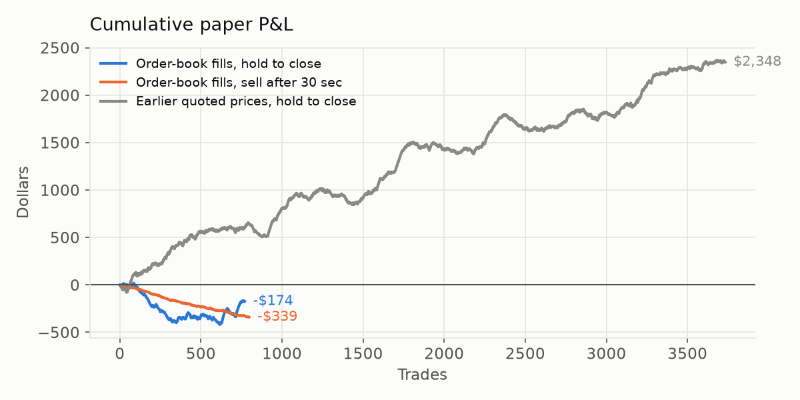
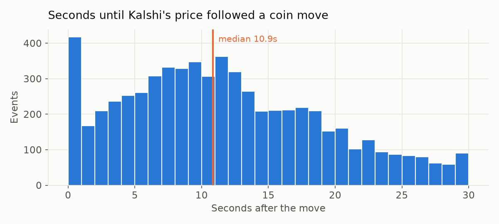

# Lag Tracker

*Updated Sun Oct 04 18:26 UTC. Paper money. Coin prices arrive live from Coinbase and Kraken; Kalshi's 15-minute crypto prices are checked every 0.5 seconds. When a coin move shifts the fair chance of UP by 5¢+ within 3 seconds, the bot pulls Kalshi's live order book, prices 10 contracts exactly as they'd fill, and paper-buys if that's still 3¢+ below fair value after fees.*

[← Back to all bots](README.md)

## Verdict

🔴 **The gap was mostly a stale quote.** Kalshi's real order book had usually already moved, so the earlier paper profits weren't fillable.

## At a glance

| Paper P&L (hold) | Return | Trades | Avg bet | Most money tied up at once | Kalshi lag (median) |
|---|---|---|---|---|---|
| **-$173.56** | -6.0% | 770 | $3.78 | $145.64 | 10.9s |

*Order-book fills. 10 contracts per buy, no bankroll limit — every trade is scored on its own.*

## Paper trades on real order-book prices

| Exit | Trades | Won | P&L | Return | Earlier / later half |
|---|---|---|---|---|---|
| Sell after 10 sec | 797 | 130 | -$336.12 | -11.1% | -$171.29 / -$164.83 |
| Sell after 30 sec | 797 | 209 | -$339.46 | -11.3% | -$194.35 / -$145.11 |
| Hold to the close | 770 | 273 | -$173.56 | -6.0% | -$351.58 / $178.02 |
| Hold, only edge 10¢+ | 266 | 67 | -$89.87 | -11.8% | -$141.96 / $52.09 |
| Hold, first trade per window only | 249 | 98 | -$32.24 | -3.2% | -$85.44 / $53.20 |

*Every buy and sell is priced by walking Kalshi's live order book for 10 contracts, using only what the bot knew at that moment. A timed sell with no buyers counts as held to the close. The last two rows re-score the same trades with stricter rules, as a robustness check.*

## Was the quoted price real?

| Events checked | Order book matched the quote (within 1¢) | Book was 2¢+ worse | Median gap (book − quote) | Avg cost of filling 10 vs best price | Skipped |
|---|---|---|---|---|---|
| 2981 | 10% | 66% | +4.3¢ | 0.3¢ | edge gone 2038, price out of range 77, spread too wide 67 |

*If the book usually matches the quote, the lag is real. If the book is usually worse, the "lag" was just a slow price display and the old paper profits weren't fillable.*

## Before the order-book check (quoted prices)

| Exit | Trades | Won | P&L | Return |
|---|---|---|---|---|
| Hold to the close | 3732 | 1844 | $2,348.29 | +14.6% |

*Oct 3–4. Bought at Kalshi's quoted price without checking the order book — likely optimistic.*

## How fast does Kalshi follow?

| Coin | Events | Kalshi catches up in (median) | Already moved before we could buy | Share of the move Kalshi made within 2 sec |
|---|---|---|---|---|
| BNB | 725 | 11.1s | 3% | 0% |
| BTC | 867 | 11.9s | 3% | 0% |
| DOGE | 958 | 10.7s | 3% | 0% |
| ETH | 1059 | 10.9s | 4% | 0% |
| HYPE | 725 | 11.6s | 3% | 0% |
| NEAR | 1005 | 10.8s | 3% | 0% |
| SOL | 1849 | 10.8s | 3% | 0% |
| XRP | 1935 | 11.1s | 3% | 0% |
| ZEC | 1125 | 9.6s | 4% | 0% |
| **All** | **10248** | **10.9s** | **3%** | **0%** |

*"Catches up" = Kalshi's quoted price moved at least half as far as our fair value did. "Already moved" = that had happened by the first Kalshi price we saw after the jump. Kalshi is checked every 0.5 seconds, so 0.5s is the fastest we can measure.*

## Feed speed

Kalshi quote check: **8 ms** · Order book check: **26 ms** · Coinbase price delay: **7 ms**

## Latest events

| Time (UTC) | Coin | Move | Fair | Quote → book | Caught up | Trade | P&L (10s / 30s / close) |
|---|---|---|---|---|---|---|---|
| 10-04 18:26:28 | ZEC | up | 0.26→0.38 | 0.16 → 0.22 | no | UP @ 0.22 | · / · / · |
| 10-04 18:26:25 | SOL | up | 0.07→0.13 | 0.08 → 0.26 | no | edge gone |  |
| 10-04 18:26:23 | XRP | down | 0.50→0.34 | 0.56 → 0.52 | no | DOWN @ 0.52 | · / · / · |
| 10-04 18:26:23 | BTC | up | 0.48→0.61 | 0.51 → 0.67 | no | edge gone |  |
| 10-04 18:26:08 | XRP | up | 0.39→0.50 | 0.48 → 0.50 | 0.30s | edge gone |  |
| 10-04 18:26:04 | ZEC | down | 0.37→0.28 | 0.67 → 0.84 | 4.06s | edge gone |  |
| 10-04 18:26:01 | NEAR | up | 0.38→0.46 | 0.64 → 0.54 | no | edge gone |  |
| 10-04 18:25:57 | BTC | down | 0.72→0.65 | 0.41 → 0.34 | 11.32s | edge gone |  |
| 10-04 18:25:54 | ETH | up | 0.36→0.44 | 0.30 → 0.42 | 14.32s | edge gone |  |
| 10-04 18:25:53 | XRP | up | 0.35→0.45 | 0.31 → 0.48 | 0.31s | edge gone |  |
| 10-04 18:25:46 | NEAR | up | 0.38→0.46 | 0.56 → 0.66 | 7.35s | spread too wide |  |
| 10-04 18:25:42 | BTC | up | 0.49→0.61 | 0.59 → 0.59 | no | edge gone |  |
| 10-04 18:25:34 | ZEC | up | 0.34→0.42 | 0.27 → 0.30 | 19.10s | spread too wide |  |
| 10-04 18:25:27 | XRP | down | 0.31→0.23 | 0.80 → 0.77 | no | edge gone |  |
| 10-04 18:25:26 | DOGE | up | 0.51→0.57 | 0.58 → 0.62 | 12.32s | edge gone |  |
| 10-04 18:25:19 | ZEC | down | 0.36→0.29 | 0.69 → 0.75 | 4.33s | edge gone |  |
| 10-04 18:25:18 | NEAR | down | 0.46→0.36 | 0.57 → 0.48 | no | DOWN @ 0.48 | -0.76 / -1.55 / · |
| 10-04 18:25:10 | DOGE | up | 0.44→0.49 | 0.57 → 0.58 | 28.33s | edge gone |  |
| 10-04 18:25:09 | ETH | down | 0.33→0.26 | 0.81 → 0.76 | 0.07s | edge gone |  |
| 10-04 18:25:06 | BTC | down | 0.56→0.50 | 0.40 → 0.50 | 17.33s | edge gone |  |
| 10-04 18:25:02 | NEAR | up | 0.34→0.40 | 0.49 → 0.52 | 20.58s | edge gone |  |
| 10-04 18:24:59 | XRP | down | 0.37→0.28 | 0.73 → 0.74 | 23.84s | edge gone |  |
| 10-04 18:24:52 | DOGE | up | 0.48→0.53 | 0.58 → 0.57 | no | edge gone |  |
| 10-04 18:24:47 | NEAR | up | 0.32→0.39 | 0.51 → 0.54 | no | edge gone |  |
| 10-04 18:24:44 | XRP | down | 0.37→0.29 | 0.73 → 0.73 | no | edge gone |  |
| 10-04 18:24:29 | XRP | up | 0.19→0.26 | 0.14 → 0.24 | 8.84s | edge gone |  |
| 10-04 18:24:08 | SOL | down | 0.17→0.11 | 0.77 → 0.87 | 15.10s | edge gone |  |
| 10-04 18:24:00 | XRP | down | 0.21→0.15 | 0.85 → 0.85 | no | edge gone |  |
| 10-04 18:23:59 | NEAR | down | 0.47→0.36 | 0.37 → 0.44 | 9.09s | DOWN @ 0.45 | -0.08 / -0.22 / · |
| 10-04 18:23:48 | SOL | down | 0.17→0.11 | 0.76 → 0.77 | no | DOWN @ 0.78 | -0.55 / 0.92 / · |
