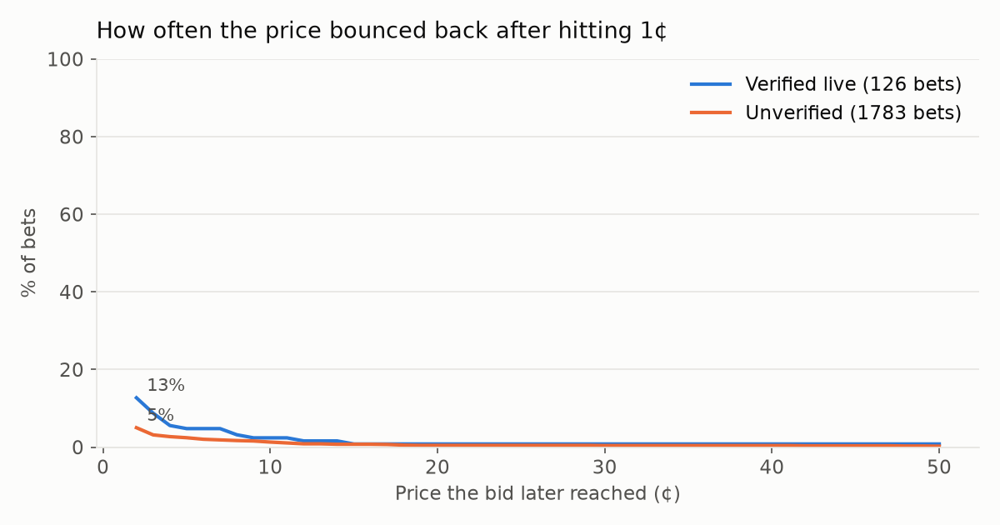
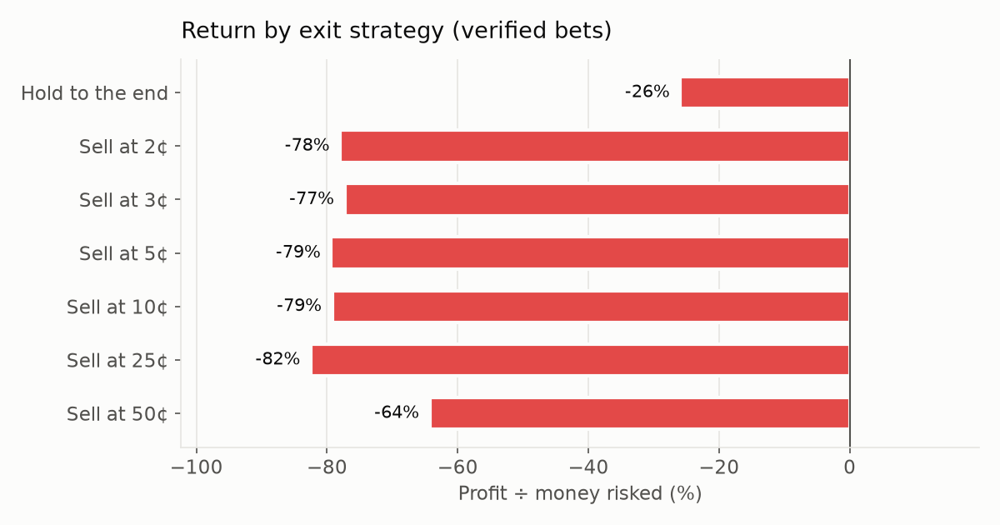
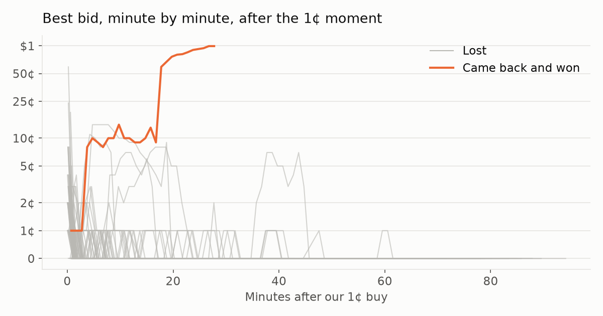

# 1¢ Study

*Updated Wed Sep 30, 10:11 PM MT. Paper money: each bet buys 14 contracts at 1¢ (14¢ + 1¢ fee). Prices come from Kalshi's own trade records and minute-by-minute bid/ask.*

[← Back to all bots](README.md)

## Current strategy

🔴 **Sit out.** No rule has made money yet, so if we turned it on now it would not buy anything.

| Rule | Based on | Hit rate | P&L (14 per buy) | Return | Avg per bet | Earlier half / later half |
|---|---|---|---|---|---|---|
| ESPN-verified leagues only, hold to the end | 126 finished bets | 1% | -$4.90 | -26% | -3.89¢ | -$9.45 / $4.55 |

*Expect about **40 buys a day**, roughly **$5.96/day** at risk; max loss per buy **15¢**.*

Runner-up rules

| Rule | Bets | P&L | Return |
|---|---|---|---|
| ESPN-verified leagues only, sell at 50¢ | 126 | -$12.15 | -64% |
| ESPN-verified leagues only, sell at 3¢ | 126 | -$14.61 | -77% |
| ESPN-verified leagues only, sell at 2¢ | 126 | -$14.74 | -78% |

*Re-picked automatically from the latest data every refresh. Rules only use what's knowable at the moment of buying (league, price, model reading), not hindsight like how the game ended.*

## Headline (verified live bets)

| 1¢ moments (all leagues) | Finished (verified) | Came back & won | Break-even win rate | Hold-to-end P&L | Best exit so far |
|---|---|---|---|---|---|
| 1914 | 126 | 1 (1%) | 1.1% | -$4.90 (-26%) | Hold to the end: -$4.90 (-26%) |

*In play right now: 5. Verified = ESPN confirmed the game was still being played when we bought. Unverified leagues are shown separately below.*

## Prediction models

*Each model's chance that our side wins, recorded at the moment we bought. Kalshi's price said about 1%. If a model knows better, only buying when it disagrees with the market should improve results.*

- **ESPN win probability:** ESPN's live in-game win-probability model (NFL, NBA, WNBA, college football & basketball)

*Readings start with the next watch session (about 10:30 PM MT, Sep 27). Leagues ESPN doesn't model show no reading.*

### How accurate is each model?

| Model | Bets scored | Avg chance it gave | Actual win rate | Accuracy vs market | Verdict |
|---|---|---|---|---|---|
| ESPN win probability | 9 | 1.1% | 0.0% (0) | -13% | ❌ Worse |

*Accuracy vs market compares the model's predictions with Kalshi's 1¢ price (log-loss skill). Positive = the model predicted outcomes better than the market.*

### Would the models have helped?

| Buy only when… | Bets | Won | Hold return | Sell@2¢ | Sell@3¢ | Sell@5¢ |
|---|---|---|---|---|---|---|
| **Any 1¢ (no model)** | 9 | 0 | -100% | -100% | -100% | -100% |
| ESPN win probability ≥ 2% | 2 | 0 | -100% | -100% | -100% | -100% |

*Compare each row with the first one: a model helps if its filtered bets earn more.*

## How high did the price bounce?

*Share of bets where someone later bid at least this much before the game ended.*

| Group | Bets | ≥2¢ | ≥3¢ | ≥5¢ | ≥10¢ | ≥25¢ | ≥50¢ |
|---|---|---|---|---|---|---|---|
| Verified | 126 | 13% | 9% | 5% | 2% | 1% | 1% |
| Unverified | 1783 | 5% | 3% | 2% | 1% | 0% | 0% |

## Exit strategies

*Sell the first time the bid reaches the target (after Kalshi's selling fee); if it never does, hold to the end. Based on the best bid each minute, assuming a 14-contract sale would fill.*

| Strategy | Hits | Hit rate | P&L | Return |
|---|---|---|---|---|
| Hold to the end | 1 | 1% | -$4.90 | -26% |
| Sell at 2¢ | 16 | 13% | -$14.74 | -78% |
| Sell at 3¢ | 11 | 9% | -$14.61 | -77% |
| Sell at 5¢ | 6 | 5% | -$15.00 | -79% |
| Sell at 10¢ | 3 | 2% | -$14.97 | -79% |
| Sell at 25¢ | 1 | 1% | -$15.59 | -82% |
| Sell at 50¢ | 1 | 1% | -$12.15 | -64% |

## By league

| League | Verified | Bets | Won | ≥2¢ | ≥5¢ | Hold return | Sell@2¢ return | Typical time left |
|---|---|---|---|---|---|---|---|---|
| TT Elite Series Match | ✘ | 785 | 0 | 1% | 1% | -100% | -99% | 5 min |
| ITF Women's Match | ✘ | 164 | 0 | 11% | 6% | -100% | -81% | 5 min |
| ITF Men's Match | ✘ | 161 | 0 | 9% | 4% | -100% | -84% | 6 min |
| Challenger ATP  | ✘ | 107 | 0 | 9% | 2% | -100% | -84% | 5 min |
| Counter-Strike 2 Game | ✘ | 92 | 1 | 4% | 3% | +1% | -92% | 11 min |
| TT Star Series Match | ✘ | 67 | 1 | 3% | 3% | +39% | -95% | 4 min |
| League of Legends Game | ✘ | 59 | 0 | 8% | 2% | -100% | -85% | 11 min |
| AFCON Game Winner | ✘ | 45 | 1 | 16% | 4% | +107% | -73% | 12 min |
| UEFA Nations League Game | ✔ | 36 | 0 | 8% | 0% | -100% | -86% | 8 min |
| CONCACAF Nations League Game | partly | 32 | 0 | 22% | 6% | -100% | -62% | 21 min |
| English National League Game | ✘ | 24 | 0 | 4% | 4% | -100% | -93% | 6 min |
| Men's T20 Cricket Match | ✘ | 22 | 0 | 14% | 9% | -100% | -76% | 15 min |
| Challenger WTA | ✘ | 19 | 0 | 16% | 11% | -100% | -73% | 10 min |
| Dota 2 Game | ✘ | 19 | 0 | 0% | 0% | -100% | -100% | 28 min |
| R6 Game | ✘ | 17 | 0 | 0% | 0% | -100% | -100% | 8 min |
| International Friendly Game | ✔ | 16 | 0 | 0% | 0% | -100% | -100% | 14 min |
| Liga DIMAYOR Game | ✘ | 12 | 0 | 0% | 0% | -100% | -100% | 12 min |
| EuroCup Basketball Game | ✘ | 12 | 0 | 0% | 0% | -100% | -100% | 8 min |
| Champions League Women's Game | partly | 11 | 1 | 27% | 18% | +748% | -53% | 20 min |
| ATP Tennis Match | ✘ | 10 | 0 | 10% | 0% | -100% | -83% | 2 min |
| KHL Game | ✘ | 10 | 0 | 0% | 0% | -100% | -100% | 5 min |
| KBO Game | ✘ | 10 | 0 | 10% | 10% | -100% | -83% | 20 min |
| Euroleague Game | ✘ | 10 | 0 | 10% | 0% | -100% | -83% | 45 min |
| WTA Tennis Match | ✘ | 9 | 0 | 11% | 0% | -100% | -81% | 3 min |
| National League Game | ✘ | 9 | 1 | 11% | 11% | +937% | -81% | 4 min |
| Japan NPB Game | ✘ | 8 | 0 | 0% | 0% | -100% | -100% | 27 min |
| Liga Leumit Game | ✘ | 8 | 0 | 0% | 0% | -100% | -100% | 10 min |
| USL Championship Game | ✔ | 8 | 0 | 25% | 0% | -100% | -57% | 11 min |
| Women's College Volleyball Match | ✘ | 7 | 0 | 14% | 0% | -100% | -75% | 30 min |
| ELH Game | ✘ | 7 | 0 | 0% | 0% | -100% | -100% | 3 min |
| NHL Game | ✔ | 7 | 0 | 14% | 0% | -100% | -75% | 4 min |
| Uruguay Primera Division Game | ✘ | 6 | 0 | 17% | 17% | -100% | -71% | 10 min |
| Professional Football Game | ✔ | 6 | 0 | 17% | 0% | -100% | -71% | 6 min |
| Brasileiro Serie B Game | ✘ | 6 | 0 | 0% | 0% | -100% | -100% | 8 min |
| Women's Pro Basketball Game | ✔ | 6 | 0 | 17% | 17% | -100% | -71% | 15 min |
| Czech NBL Game | ✘ | 6 | 0 | 0% | 0% | -100% | -100% | 7 min |
| Valorant game winner | ✘ | 5 | 0 | 0% | 0% | -100% | -100% | 12 min |
| Liiga Game | ✘ | 5 | 0 | 0% | 0% | -100% | -100% | 3 min |
| Slovakia SBL Game | ✘ | 5 | 0 | 0% | 0% | -100% | -100% | 35 min |
| NWSL Game | ✔ | 4 | 0 | 0% | 0% | -100% | -100% | 5 min |
| Major League Soccer Game | partly | 4 | 0 | 0% | 0% | -100% | -100% | 8 min |
| APF Division de Honor Game | ✘ | 4 | 0 | 0% | 0% | -100% | -100% | 4 min |
| Women's ODI Cricket Match | ✘ | 4 | 0 | 0% | 0% | -100% | -100% | 38 min |
| Finland Korisliiga Game | ✘ | 4 | 0 | 0% | 0% | -100% | -100% | 63 min |
| Sweden SBL Game | ✘ | 4 | 0 | 0% | 0% | -100% | -100% | 36 min |
| Professional Baseball Game | ✔ | 4 | 0 | 0% | 0% | -100% | -100% | 19 min |
| SHL Game | ✘ | 3 | 0 | 0% | 0% | -100% | -100% | 7 min |
| Argentine Nacional B Game | ✘ | 2 | 0 | 0% | 0% | -100% | -100% | 8 min |
| Brasileiro Serie C Game | ✘ | 2 | 0 | 50% | 50% | -100% | -13% | 11 min |
| LNBP Basketball Game | ✘ | 2 | 0 | 0% | 0% | -100% | -100% | 82 min |
| Liga MX Game | ✔ | 2 | 0 | 50% | 50% | -100% | -13% | 9 min |
| Slovakian 2. Liga Game | ✘ | 2 | 0 | 0% | 0% | -100% | -100% | 2 min |
| LaLiga 2 Game | ✔ | 2 | 0 | 50% | 0% | -100% | -13% | 26 min |
| China League 1 Game | ✘ | 2 | 0 | 0% | 0% | -100% | -100% | 11 min |
| Slovakian Cup Game | ✘ | 2 | 0 | 0% | 0% | -100% | -100% | 14 min |
| Slovenia 1. SKL Game | ✘ | 2 | 0 | 50% | 50% | -100% | -13% | 105 min |
| Australia NBL Game | ✘ | 2 | 0 | 0% | 0% | -100% | -100% | 22 min |
| Men's ODI Cricket Match | ✘ | 2 | 0 | 0% | 0% | -100% | -100% | 45 min |
| Russia VTB United Game | ✘ | 2 | 0 | 50% | 0% | -100% | -13% | 37 min |
| Peru Liga 1 Game | ✘ | 2 | 0 | 50% | 50% | -100% | -13% | 17 min |
| Canadian Premier League | ✘ | 2 | 0 | 50% | 50% | -100% | -13% | 18 min |
| Overwatch Game | ✘ | 1 | 0 | 0% | 0% | -100% | -100% | 4 min |
| Croatia Premijer Liga Game | ✘ | 1 | 0 | 0% | 0% | -100% | -100% | 98 min |

## By time left when it hit 1¢

| Time left in game | Bets | ≥2¢ | ≥5¢ | Won | Sell@2¢ return |
|---|---|---|---|---|---|
| Under 5 min | 46 | 4% | 0% | 0% | -92% |
| 5–15 min | 26 | 19% | 4% | 0% | -67% |
| 15–30 min | 23 | 22% | 13% | 4% | -62% |
| 30–60 min | 17 | 24% | 12% | 0% | -59% |
| Over 60 min | 14 | 0% | 0% | 0% | -100% |

## Speed & liquidity

| Metric | Typical (median) |
|---|---|
| Our buy vs Kalshi's first 1¢ trade | 29 sec later |
| Time from 1¢ to its best bounce (bounced bets) | 6 min |
| Contracts traded at 1¢ after our buy (how much you could buy) | 0 |

## Latest bets

*Times are UTC. Peak = best bid after our buy.*

| When | League | Pick | Verified | Situation at 1¢ | Peak | Result | Hold P&L |
|---|---|---|---|---|---|---|---|
| 10-01 04:07 | TT Elite Series Match | Marcin Jadczyk | ✘ | — | — | In play | — |
| 10-01 04:07 | USL Championship Game | Tie | ✔ | 90'+8' · LVL 2 - SAC 3 | — | In play | — |
| 10-01 04:06 | TT Elite Series Match | Vincenec Oliver | ✘ | — | 0¢ | ❌ Lost | -$0.15 |
| 10-01 03:55 | TT Elite Series Match | Oracz Lukasz | ✘ | — | 0¢ | ❌ Lost | -$0.15 |
| 10-01 03:53 | USL Championship Game | Las Vegas Lights | ✔ | 84' · LVL 2 - SAC 3 | — | In play | — |
| 10-01 03:49 | Women's Pro Basketball Game | Golden State | ✔ | 21.9 - OT · GS 100 - DAL 105 | 1¢ | ❌ Lost | -$0.15 |
| 10-01 03:48 | TT Elite Series Match | Andriej Fomin | ✘ | — | 0¢ | ❌ Lost | -$0.15 |
| 10-01 03:48 | ITF Women's Match | Nana Onozawa | ✘ | — | 0¢ | ❌ Lost | -$0.15 |
| 10-01 03:44 | TT Elite Series Match | Krzysztof Wloczko | ✘ | — | 0¢ | ❌ Lost | -$0.15 |
| 10-01 03:40 | TT Elite Series Match | Krzysztof Kapik | ✘ | — | 0¢ | ❌ Lost | -$0.15 |
| 10-01 03:39 | TT Elite Series Match | Mariusz Baron | ✘ | — | 0¢ | ❌ Lost | -$0.15 |
| 10-01 03:38 | TT Elite Series Match | Blazej Warpas | ✘ | — | 0¢ | ❌ Lost | -$0.15 |
| 10-01 03:24 | TT Elite Series Match | Oliwier Sokolowski | ✘ | — | 0¢ | ❌ Lost | -$0.15 |
| 10-01 03:20 | Men's T20 Cricket Match | Bangladesh | ✘ | — | 0¢ | ❌ Lost | -$0.15 |
| 10-01 03:18 | TT Elite Series Match | Jakub Kuzmicz | ✘ | — | 0¢ | ❌ Lost | -$0.15 |
| 10-01 03:15 | TT Elite Series Match | Maciej Kolek | ✘ | — | 0¢ | ❌ Lost | -$0.15 |
| 10-01 03:12 | TT Elite Series Match | Karol Sulkowski | ✘ | — | 0¢ | ❌ Lost | -$0.15 |
| 10-01 03:09 | TT Elite Series Match | Pawel Slosarczyk | ✘ | — | 0¢ | ❌ Lost | -$0.15 |
| 10-01 03:09 | ITF Women's Match | Yuhan Liu | ✘ | — | 0¢ | ❌ Lost | -$0.15 |
| 10-01 03:08 | TT Elite Series Match | Adrian Burkacki | ✘ | — | 0¢ | ❌ Lost | -$0.15 |
| 10-01 03:08 | TT Elite Series Match | Bartek Sulkowski | ✘ | — | 0¢ | ❌ Lost | -$0.15 |
| 10-01 03:06 | TT Elite Series Match | Jerzy Michalik | ✘ | — | 0¢ | ❌ Lost | -$0.15 |
| 10-01 02:48 | TT Elite Series Match | Skorupa Jakub | ✘ | — | 0¢ | ❌ Lost | -$0.15 |
| 10-01 02:47 | TT Elite Series Match | Lebek Marian | ✘ | — | 0¢ | ❌ Lost | -$0.15 |
| 10-01 02:39 | Liga DIMAYOR Game | Tie | ✘ | — | 0¢ | ❌ Lost | -$0.15 |
| 10-01 02:30 | Liga DIMAYOR Game | Junior | ✘ | — | 0¢ | ❌ Lost | -$0.15 |
| 10-01 02:28 | TT Elite Series Match | Michał Machelski | ✘ | — | 0¢ | ❌ Lost | -$0.15 |
| 10-01 02:23 | TT Elite Series Match | Oliwier Sokolowski | ✘ | — | 0¢ | ❌ Lost | -$0.15 |
| 10-01 02:15 | NHL Game | New York I | ✔ | 0:26 - 3rd · NYI 1 - TOR 2 | 0¢ | ❌ Lost | -$0.15 |
| 10-01 02:06 | TT Elite Series Match | Witold Stechly | ✘ | — | 0¢ | ❌ Lost | -$0.15 |

## Raw data

- [study/bets.csv](study/bets.csv) — one row per bet with every metric
- `study/ticks/` — every Kalshi trade from the first 1¢ trade to the end, per bet
- `study/candles/` — minute-by-minute bid / ask / volume, per bet
