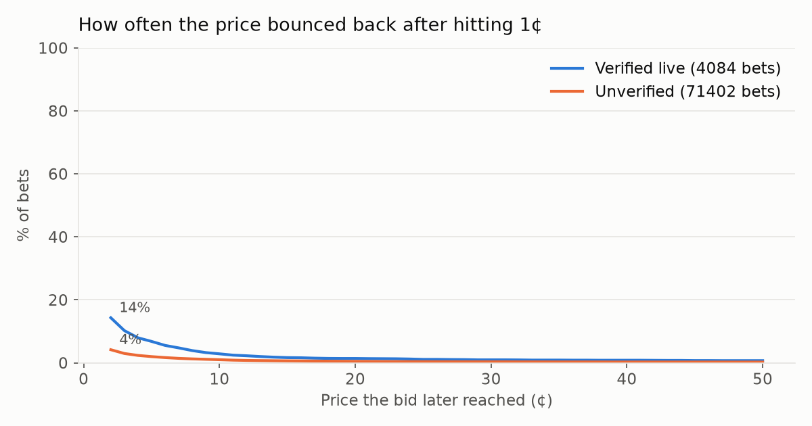

# 1¢ Study

*Updated Sun Nov 15, 6:55 AM MT. Paper money: each bet buys 14 contracts at 1¢ (14¢ + 1¢ fee). Prices come from Kalshi's own trade records and minute-by-minute bid/ask.*

[← Back to all bots](README.md)

## Current strategy

🟡 **Unproven.** Profitable overall, but not in both the earlier and later halves of the data.

1. **Watch** every live game in **ESPN win probability ≥ 5%**.
2. **Buy** when a team or player's YES price hits **1¢**: **14 contracts** with a 1¢ limit order (cost 15¢ including the fee). One buy per outcome.
3. **Hold** every position until the game ends. No selling.

| Rule | Based on | Hit rate | P&L (14 per buy) | Return | Avg per bet | Earlier half / later half |
|---|---|---|---|---|---|---|
| ESPN win probability ≥ 5%, hold to the end | 71 finished bets | 1% | $3.35 | +31% | +4.72¢ | $8.75 / -$5.40 |

*Expect about **2 buys a day**, roughly **$0.25/day** at risk; max loss per buy **15¢**.*

Runner-up rules

| Rule | Bets | P&L | Return |
|---|---|---|---|
| ESPN win probability ≥ 5%, sell at 50¢ | 71 | -$3.90 | -37% |
| ESPN win probability ≥ 5%, sell at 25¢ | 71 | -$4.03 | -38% |
| ESPN win probability ≥ 5%, sell at 10¢ | 71 | -$8.03 | -75% |

*Re-picked automatically from the latest data every refresh. Rules only use what's knowable at the moment of buying (league, price, model reading), not hindsight like how the game ended.*

## Headline (verified live bets)

| 1¢ moments (all leagues) | Finished (verified) | Came back & won | Break-even win rate | Hold-to-end P&L | Best exit so far |
|---|---|---|---|---|---|
| 62665 | 3436 | 13 (0%) | 1.1% | -$333.40 (-65%) | Hold to the end: -$333.40 (-65%) |

*In play right now: 51. Verified = ESPN confirmed the game was still being played when we bought. Unverified leagues are shown separately below.*

## Prediction models

*Each model's chance that our side wins, recorded at the moment we bought. Kalshi's price said about 1%. If a model knows better, only buying when it disagrees with the market should improve results.*

- **ESPN win probability:** ESPN's live in-game win-probability model (NFL, NBA, WNBA, college football & basketball)

*Readings start with the next watch session (about 10:30 PM MT, Sep 27). Leagues ESPN doesn't model show no reading.*

### How accurate is each model?

| Model | Bets scored | Avg chance it gave | Actual win rate | Accuracy vs market | Verdict |
|---|---|---|---|---|---|
| ESPN win probability | 848 | 2.7% | 0.1% (1) | -232% | ❌ Worse |

*Accuracy vs market compares the model's predictions with Kalshi's 1¢ price (log-loss skill). Positive = the model predicted outcomes better than the market.*

### Would the models have helped?

| Buy only when… | Bets | Won | Hold return | Sell@2¢ | Sell@3¢ | Sell@5¢ |
|---|---|---|---|---|---|---|
| **Any 1¢ (no model)** | 848 | 1 | -89% | -71% | -71% | -72% |
| ESPN win probability ≥ 2% | 163 | 1 | -43% | -61% | -63% | -65% |
| ESPN win probability ≥ 5% | 71 | 1 | +31% | -80% | -85% | -88% |
| ESPN win probability ≥ 10% | 47 | 1 | +99% | -78% | -78% | -82% |

*Compare each row with the first one: a model helps if its filtered bets earn more.*

## How high did the price bounce?

*Share of bets where someone later bid at least this much before the game ended.*

| Group | Bets | ≥2¢ | ≥3¢ | ≥5¢ | ≥10¢ | ≥25¢ | ≥50¢ |
|---|---|---|---|---|---|---|---|
| Verified | 3436 | 14% | 10% | 7% | 3% | 1% | 1% |
| Unverified | 59178 | 4% | 3% | 2% | 1% | 0% | 0% |

## Exit strategies

*Sell the first time the bid reaches the target (after Kalshi's selling fee); if it never does, hold to the end. Based on the best bid each minute, assuming a 14-contract sale would fill.*

| Strategy | Hits | Hit rate | P&L | Return |
|---|---|---|---|---|
| Hold to the end | 13 | 0% | -$333.40 | -65% |
| Sell at 2¢ | 483 | 14% | -$389.82 | -76% |
| Sell at 3¢ | 339 | 10% | -$383.19 | -74% |
| Sell at 5¢ | 228 | 7% | -$367.20 | -71% |
| Sell at 10¢ | 94 | 3% | -$392.26 | -76% |
| Sell at 25¢ | 36 | 1% | -$396.24 | -77% |
| Sell at 50¢ | 23 | 1% | -$360.15 | -70% |

## By league

| League | Verified | Bets | Won | ≥2¢ | ≥5¢ | Hold return | Sell@2¢ return | Typical time left |
|---|---|---|---|---|---|---|---|---|
| eSoccer Game | ✘ | 29722 | 22 | 1% | 1% | -93% | -98% | 3 min |
| Russia Liga Pro Match | ✘ | 3737 | 0 | 1% | 1% | -100% | -98% | 4 min |
| eBasketball Game | ✘ | 2916 | 5 | 3% | 1% | -84% | -92% | 3 min |
| ITF Women's Match | ✘ | 1874 | 8 | 14% | 6% | -60% | -76% | 4 min |
| ITF Men's Match | ✘ | 1815 | 4 | 14% | 6% | -79% | -76% | 5 min |
| Counter-Strike 2 Game | ✘ | 1675 | 3 | 6% | 3% | -83% | -90% | 11 min |
| TT Elite Series Match | ✘ | 1304 | 0 | 1% | 1% | -100% | -98% | 5 min |
| Challenger ATP  | ✘ | 1094 | 5 | 11% | 4% | -57% | -81% | 5 min |
| College Football Game | partly | 628 | 3 | 11% | 5% | -55% | -81% | 23 min |
| eFootball Game | ✘ | 625 | 2 | 1% | 1% | -70% | -98% | 2 min |
| Men's College Basketball Game | partly | 613 | 5 | 19% | 7% | -24% | -68% | 26 min |
| Women's College Basketball Game | partly | 573 | 2 | 14% | 4% | -67% | -75% | 35 min |
| Darts Match | ✘ | 421 | 0 | 0% | 0% | -100% | -100% | 7 min |
| Women's College Volleyball Match | ✘ | 397 | 2 | 4% | 2% | -53% | -93% | 56 min |
| Dota 2 Game | ✘ | 393 | 1 | 1% | 1% | -76% | -98% | 32 min |
| Serie C Game | ✘ | 365 | 2 | 4% | 2% | -49% | -93% | 8 min |
| Men's T20 Cricket Match | ✘ | 357 | 2 | 16% | 7% | -48% | -73% | 23 min |
| NHL Game | ✔ | 321 | 2 | 15% | 8% | -42% | -74% | 5 min |
| TT Star Series Match | ✘ | 320 | 1 | 2% | 2% | -71% | -97% | 5 min |
| Challenger WTA | ✘ | 290 | 1 | 13% | 4% | -68% | -78% | 9 min |
| NBA Game | partly | 244 | 0 | 20% | 7% | -100% | -65% | 11 min |
| AHL Game | ✘ | 241 | 0 | 3% | 2% | -100% | -94% | 6 min |
| Major League Soccer Game | partly | 217 | 1 | 12% | 6% | -57% | -80% | 8 min |
| College Hockey Game | ✘ | 216 | 0 | 1% | 0% | -100% | -98% | 13 min |
| WTA Tennis Match | ✘ | 195 | 0 | 12% | 3% | -100% | -79% | 5 min |
| UEFA Nations League Game | ✔ | 192 | 0 | 11% | 5% | -100% | -80% | 8 min |
| Ettan Game | ✘ | 177 | 0 | 5% | 1% | -100% | -92% | 10 min |
| Argentina Primera Division Game | ✘ | 175 | 2 | 17% | 9% | +7% | -71% | 9 min |
| Liga DIMAYOR Game | ✘ | 173 | 1 | 10% | 3% | -46% | -82% | 9 min |
| Japan J2 League Game | ✘ | 173 | 1 | 10% | 4% | -46% | -83% | 7 min |
| League of Legends Game | ✘ | 164 | 0 | 7% | 2% | -100% | -87% | 11 min |
| Brasileiro Serie B Game | ✘ | 162 | 1 | 7% | 3% | -42% | -87% | 10 min |
| KHL Game | ✘ | 155 | 0 | 4% | 2% | -100% | -93% | 6 min |
| Argentine Nacional B Game | ✘ | 150 | 0 | 8% | 5% | -100% | -86% | 8 min |
| ATP Tennis Match | ✘ | 150 | 0 | 16% | 7% | -100% | -72% | 4 min |
| English National League Game | ✘ | 149 | 1 | 8% | 6% | -37% | -86% | 10 min |
| EFL Championship Game | ✔ | 149 | 1 | 9% | 5% | -37% | -85% | 9 min |
| CONCACAF Nations League Game | partly | 138 | 2 | 21% | 9% | +35% | -64% | 20 min |
| Valorant game winner | ✘ | 138 | 0 | 4% | 3% | -100% | -92% | 11 min |
| Overwatch Game | ✘ | 131 | 0 | 2% | 0% | -100% | -97% | 6 min |
| LaLiga 2 Game | partly | 124 | 1 | 19% | 8% | -25% | -68% | 9 min |
| Brasileiro Serie A Game | partly | 124 | 1 | 10% | 6% | -25% | -82% | 9 min |
| EFL League One Game | ✔ | 122 | 0 | 8% | 2% | -100% | -86% | 10 min |
| R6 Game | ✘ | 121 | 1 | 10% | 4% | -23% | -83% | 8 min |
| USL Championship Game | partly | 120 | 0 | 11% | 4% | -100% | -81% | 5 min |
| Women's T20 Match | ✘ | 120 | 0 | 17% | 5% | -100% | -71% | 28 min |
| Eerste Divisie Game | ✘ | 119 | 0 | 8% | 4% | -100% | -85% | 12 min |
| Japan J League Game | ✘ | 119 | 1 | 16% | 7% | -22% | -72% | 12 min |
| Serie B Game | ✘ | 115 | 0 | 10% | 5% | -100% | -82% | 9 min |
| Japan B League Game | ✘ | 114 | 0 | 8% | 1% | -100% | -86% | 12 min |
| German 3. Liga Game | ✘ | 113 | 0 | 11% | 4% | -100% | -82% | 10 min |
| Liiga Game | ✘ | 112 | 0 | 0% | 0% | -100% | -100% | 5 min |
| Serie A Game | ✔ | 112 | 0 | 10% | 5% | -100% | -83% | 12 min |
| Liga MX Game | ✔ | 110 | 0 | 14% | 8% | -100% | -76% | 7 min |
| UEFA Champions League Game | partly | 109 | 1 | 11% | 5% | -14% | -81% | 10 min |
| Peru Liga 1 Game | ✘ | 106 | 0 | 17% | 8% | -100% | -71% | 14 min |
| EuroCup Basketball Game | ✘ | 104 | 0 | 5% | 4% | -100% | -92% | 11 min |
| National League Game | ✘ | 102 | 1 | 1% | 1% | -8% | -98% | 6 min |
| Slovakian 2. Liga Game | ✘ | 100 | 0 | 5% | 4% | -100% | -91% | 44 min |
| Liga Expansion Game | ✘ | 99 | 0 | 6% | 3% | -100% | -89% | 13 min |
| TFF 1. Lig Game | ✘ | 98 | 0 | 12% | 7% | -100% | -79% | 11 min |
| Indonesia Super League Game | ✘ | 96 | 0 | 12% | 7% | -100% | -78% | 12 min |
| Chinese Basketball Association Game  | ✘ | 95 | 0 | 8% | 2% | -100% | -85% | 10 min |
| Tweede Divisie Game | ✘ | 94 | 0 | 1% | 0% | -100% | -98% | 7 min |
| La Liga Game | ✔ | 94 | 0 | 18% | 12% | -100% | -69% | 8 min |
| English Premier League Game | ✔ | 94 | 1 | 9% | 4% | -1% | -85% | 10 min |
| Euroleague Game | ✘ | 93 | 0 | 20% | 6% | -100% | -65% | 13 min |
| Liga Leumit Game | ✘ | 90 | 0 | 4% | 3% | -100% | -92% | 18 min |
| Ligue 2 Game | ✘ | 90 | 0 | 8% | 6% | -100% | -87% | 12 min |
| China League 1 Game | ✘ | 89 | 0 | 9% | 4% | -100% | -84% | 12 min |
| Uruguay Primera Division Game | ✘ | 88 | 0 | 10% | 5% | -100% | -82% | 10 min |
| Men's ODI Cricket Match | ✘ | 88 | 3 | 19% | 7% | +218% | -67% | 55 min |
| NFL Game | ✔ | 88 | 1 | 17% | 7% | +6% | -70% | 8 min |
| UEFA Europa League Game | partly | 88 | 1 | 16% | 8% | +6% | -72% | 11 min |
| UEFA Conference League Game | partly | 88 | 0 | 15% | 9% | -100% | -74% | 13 min |
| ELH Game | ✘ | 86 | 0 | 1% | 1% | -100% | -98% | 5 min |
| SHL Game | ✘ | 86 | 0 | 3% | 2% | -100% | -94% | 6 min |
| AFCON Game Winner | ✘ | 85 | 1 | 18% | 6% | +10% | -69% | 22 min |
| Copa Del Rey Game | ✘ | 85 | 0 | 6% | 5% | -100% | -90% | 40 min |
| Polish Ekstraklasa Game | ✘ | 85 | 0 | 12% | 7% | -100% | -80% | 12 min |
| Italy Serie A2 Game | ✘ | 81 | 1 | 2% | 1% | +15% | -96% | 6 min |
| Allsvenskan Game | ✘ | 81 | 1 | 14% | 9% | +15% | -76% | 13 min |
| Bundesliga Game | ✔ | 81 | 1 | 17% | 9% | +15% | -70% | 9 min |
| Korea K-League 2 Game | ✘ | 80 | 0 | 11% | 6% | -100% | -80% | 9 min |
| Mobile Legends Bang Bang Game | ✘ | 80 | 0 | 0% | 0% | -100% | -100% | 4 min |
| Ligue 1 Game | ✔ | 80 | 0 | 15% | 6% | -100% | -74% | 9 min |
| DEL Game | ✘ | 79 | 0 | 0% | 0% | -100% | -100% | 5 min |
| International Friendly Game | partly | 78 | 1 | 15% | 6% | +20% | -73% | 15 min |
| Eliteserien Game | ✘ | 78 | 0 | 10% | 4% | -100% | -82% | 16 min |
| Turkish Super Lig Game | ✘ | 78 | 0 | 18% | 4% | -100% | -69% | 17 min |
| NWSL Game | ✔ | 77 | 0 | 6% | 1% | -100% | -89% | 7 min |
| APF Division de Honor Game | ✘ | 77 | 0 | 16% | 4% | -100% | -73% | 13 min |
| Saudi Pro League Game | ✘ | 76 | 2 | 18% | 12% | +146% | -68% | 13 min |
| Eredivisie Game | ✔ | 76 | 0 | 9% | 7% | -100% | -84% | 5 min |
| Ecuador Liga Pro Game | ✘ | 76 | 0 | 7% | 1% | -100% | -89% | 12 min |
| Czech First League Game | ✘ | 75 | 0 | 8% | 0% | -100% | -86% | 12 min |
| LNB Elite 2 Game | ✘ | 74 | 0 | 1% | 0% | -100% | -98% | 6 min |
| Bolivia Premier Division Game | ✘ | 74 | 0 | 8% | 1% | -100% | -86% | 11 min |
| Bundesliga 2 Game | ✔ | 73 | 0 | 15% | 7% | -100% | -74% | 8 min |
| AFC Champions League Game | ✘ | 72 | 0 | 6% | 1% | -100% | -90% | 12 min |
| FIBA Europe Cup Game | ✘ | 70 | 0 | 7% | 3% | -100% | -88% | 9 min |
| England Women's Super League Game | ✘ | 68 | 0 | 13% | 6% | -100% | -77% | 22 min |
| Thai League 1 Game | ✘ | 68 | 0 | 16% | 7% | -100% | -72% | 15 min |
| Belgian Pro League Game | ✘ | 68 | 0 | 7% | 0% | -100% | -87% | 19 min |
| Israeli Premier League Game | ✘ | 68 | 0 | 6% | 1% | -100% | -90% | 13 min |
| Liga Portugal Game | ✘ | 67 | 0 | 6% | 3% | -100% | -90% | 13 min |
| LNBP Basketball Game | ✘ | 64 | 0 | 11% | 3% | -100% | -81% | 14 min |
| Czech National Football League Game | ✘ | 64 | 0 | 11% | 6% | -100% | -81% | 9 min |
| Finland Korisliiga Game | ✘ | 63 | 1 | 6% | 3% | +48% | -89% | 9 min |
| Chile Liga de Primera Game | ✘ | 63 | 0 | 13% | 2% | -100% | -78% | 14 min |
| Serie A Femminile Game | ✘ | 63 | 0 | 3% | 2% | -100% | -94% | 13 min |
| FIFA Women's Game | ✘ | 63 | 1 | 14% | 8% | +48% | -75% | 47 min |
| Super League Greece Game | ✘ | 63 | 0 | 17% | 3% | -100% | -70% | 14 min |
| Chinese Super League Game | ✘ | 62 | 1 | 11% | 6% | +51% | -80% | 19 min |
| Serbian SuperLiga Game | ✘ | 62 | 0 | 3% | 2% | -100% | -94% | 15 min |
| Spanish Liga F Game | ✘ | 62 | 0 | 10% | 6% | -100% | -83% | 11 min |
| Brazil NBB Basketball Game | ✘ | 62 | 0 | 6% | 3% | -100% | -89% | 16 min |
| Vietnam V-League 1 Game | ✘ | 60 | 1 | 5% | 3% | +56% | -91% | 11 min |
| Korea K League Game | ✘ | 60 | 1 | 15% | 8% | +56% | -74% | 8 min |
| KBO Game | ✘ | 57 | 0 | 11% | 5% | -100% | -82% | 6 min |
| Adriatic ABA Game | ✘ | 56 | 1 | 7% | 4% | +67% | -88% | 9 min |
| Scottish Premiership Game | ✘ | 56 | 0 | 9% | 2% | -100% | -85% | 11 min |
| Venezuela Liga FUTVE game | ✘ | 56 | 0 | 18% | 11% | -100% | -69% | 7 min |
| LNB Elite Game | ✘ | 55 | 0 | 2% | 0% | -100% | -97% | 9 min |
| Romanian Liga I Game | ✘ | 55 | 0 | 11% | 2% | -100% | -81% | 13 min |
| Spain Liga ACB Game | ✘ | 54 | 0 | 7% | 4% | -100% | -87% | 13 min |
| Australia NBL Game | ✘ | 53 | 0 | 8% | 6% | -100% | -87% | 10 min |
| Taca de Portugal Game | ✘ | 52 | 0 | 15% | 4% | -100% | -73% | 14 min |
| Czech NBL Game | ✘ | 51 | 0 | 2% | 0% | -100% | -97% | 16 min |
| Bundesliga Basketball Game | ✘ | 50 | 0 | 8% | 4% | -100% | -86% | 13 min |
| Rugby French 14 Match | ✘ | 50 | 0 | 0% | 0% | -100% | -100% | 8 min |
| Egyptian Premier League Game | ✘ | 50 | 0 | 6% | 6% | -100% | -90% | 6 min |
| Danish Superliga Game | ✘ | 49 | 0 | 10% | 6% | -100% | -82% | 13 min |
| Korea KBL Game | ✘ | 49 | 0 | 0% | 0% | -100% | -100% | 4 min |
| French Women's Première Ligue Game | ✘ | 49 | 0 | 10% | 8% | -100% | -82% | 14 min |
| Champions League Women's Game | partly | 48 | 1 | 19% | 8% | +94% | -68% | 26 min |
| Italy Serie A Game | ✘ | 48 | 0 | 4% | 2% | -100% | -93% | 6 min |
| Sweden SBL Game | ✘ | 47 | 0 | 4% | 4% | -100% | -93% | 14 min |
| Croatia HNL Game | ✘ | 47 | 0 | 9% | 4% | -100% | -85% | 11 min |
| Qatar Stars League | ✘ | 47 | 0 | 11% | 4% | -100% | -82% | 10 min |
| KNVB Cup Game | ✘ | 47 | 0 | 17% | 11% | -100% | -70% | 13 min |
| Latvian Virsliga Game | ✘ | 45 | 0 | 16% | 7% | -100% | -73% | 22 min |
| Slovenian Prva Liga Game | ✘ | 45 | 0 | 9% | 2% | -100% | -85% | 12 min |
| Swiss Super League Game | ✘ | 45 | 1 | 4% | 2% | +107% | -92% | 7 min |
| Liga Nacional de Basquetbol Game | ✘ | 44 | 0 | 2% | 0% | -100% | -96% | 6 min |
| Hungarian NB I Game | ✘ | 44 | 0 | 7% | 7% | -100% | -88% | 9 min |
| Austria BSL Game | ✘ | 42 | 0 | 7% | 5% | -100% | -88% | 9 min |
| Turkey BSL Game | ✘ | 42 | 0 | 2% | 2% | -100% | -96% | 10 min |
| Australian A League Game | ✘ | 42 | 0 | 10% | 2% | -100% | -83% | 11 min |
| Indian Super League Game | ✘ | 42 | 0 | 14% | 7% | -100% | -75% | 9 min |
| Faroe Islands Premier League Game | ✘ | 40 | 0 | 2% | 0% | -100% | -96% | 31 min |
| German Women's Bundesliga Game | ✘ | 40 | 0 | 5% | 2% | -100% | -91% | 26 min |
| Austrian Bundesliga Game | ✘ | 40 | 0 | 8% | 5% | -100% | -87% | 14 min |
| Canadian Premier League | ✘ | 39 | 1 | 15% | 13% | +139% | -73% | 17 min |
| EFL Trophy Game | ✘ | 39 | 0 | 10% | 5% | -100% | -82% | 46 min |
| Russia VTB United Game | ✘ | 38 | 0 | 5% | 0% | -100% | -91% | 16 min |
| BNXT League Game | ✘ | 37 | 0 | 5% | 3% | -100% | -91% | 10 min |
| Japan NPB Game | ✘ | 36 | 0 | 0% | 0% | -100% | -100% | 2 min |
| FIBA Champions League Game | ✘ | 36 | 0 | 0% | 0% | -100% | -100% | 10 min |
| Slovakia SBL Game | ✘ | 35 | 0 | 3% | 0% | -100% | -95% | 15 min |
| Croatia Premijer Liga Game | ✘ | 35 | 0 | 0% | 0% | -100% | -100% | 8 min |
| England Super League Basketball Game | ✘ | 34 | 0 | 0% | 0% | -100% | -100% | 6 min |
| DFB Pokal Game | ✘ | 32 | 0 | 16% | 6% | -100% | -73% | 18 min |
| LKL Lithuania Game | ✘ | 31 | 0 | 3% | 0% | -100% | -94% | 9 min |
| Slovenia 1. SKL Game | ✘ | 30 | 0 | 3% | 3% | -100% | -94% | 15 min |
| Eredivisie Vrouwen Game | ✘ | 30 | 0 | 3% | 3% | -100% | -94% | 9 min |
| Ligue Magnus Game | ✘ | 30 | 0 | 0% | 0% | -100% | -100% | 7 min |
| Singapore Premier League Game | ✘ | 29 | 0 | 14% | 3% | -100% | -76% | 18 min |
| Slovakian Cup Game | ✘ | 28 | 0 | 7% | 4% | -100% | -88% | 18 min |
| Women's ODI Cricket Match | ✘ | 27 | 0 | 15% | 7% | -100% | -74% | 40 min |
| Men's Iceland Basketball Premier League Game | ✘ | 27 | 0 | 15% | 7% | -100% | -74% | 7 min |
| Call of Duty Games | ✘ | 27 | 0 | 0% | 0% | -100% | -100% | 38 min |
| Polish Hockey Game | ✘ | 25 | 0 | 4% | 4% | -100% | -93% | 6 min |
| UAE Pro League | ✘ | 24 | 0 | 4% | 4% | -100% | -93% | 17 min |
| EuroLeague (W) Game | ✘ | 24 | 0 | 8% | 0% | -100% | -86% | 9 min |
| South African Premiership Game | ✘ | 23 | 0 | 0% | 0% | -100% | -100% | 4 min |
| Professional Baseball Game | partly | 22 | 0 | 14% | 9% | -100% | -76% | 2 min |
| Finnish Ykkosliiga Game | ✘ | 21 | 1 | 10% | 5% | +344% | -83% | 6 min |
| CFL Game | ✘ | 20 | 0 | 5% | 0% | -100% | -91% | 8 min |
| Colombia LBP Basketball Game | ✘ | 19 | 0 | 0% | 0% | -100% | -100% | 17 min |
| Women's Pro Basketball Game | ✔ | 18 | 0 | 22% | 6% | -100% | -61% | 6 min |
| Malaysia Super League Game | ✘ | 17 | 0 | 12% | 0% | -100% | -80% | 9 min |
| Philippines PBA Game | ✘ | 17 | 0 | 0% | 0% | -100% | -100% | 11 min |
| EuroBasket (W) Game | ✘ | 17 | 0 | 6% | 0% | -100% | -90% | 11 min |
| Brasileiro Serie C Game | ✘ | 16 | 0 | 19% | 12% | -100% | -68% | 5 min |
| EFL Cup Game | ✘ | 16 | 0 | 19% | 0% | -100% | -68% | 15 min |
| Coppa Italia Lega Pro Game | ✘ | 16 | 0 | 6% | 6% | -100% | -89% | 9 min |
| Liga Portugal 2 Game | ✘ | 16 | 0 | 19% | 12% | -100% | -68% | 18 min |
| EFL League Two Game | ✔ | 16 | 0 | 12% | 12% | -100% | -78% | 5 min |
| Greek Cup Game | ✘ | 15 | 0 | 7% | 0% | -100% | -88% | 12 min |
| Israel Super League Game | ✘ | 13 | 0 | 8% | 8% | -100% | -87% | 13 min |
| Women's Bundesliga Basketball Game | ✘ | 12 | 0 | 0% | 0% | -100% | -100% | 3 min |
| Slovakia Niké liga Game | ✘ | 12 | 0 | 8% | 0% | -100% | -86% | 21 min |
| Powerslap Match Winner | ✘ | 11 | 0 | 9% | 9% | -100% | -84% | 7 min |
| United Rugby Championship Match | ✘ | 10 | 0 | 0% | 0% | -100% | -100% | 5 min |
| Champions League Hockey | ✘ | 10 | 0 | 0% | 0% | -100% | -100% | 6 min |
| Ukraine SuperLeague Game | ✘ | 9 | 0 | 11% | 0% | -100% | -81% | 7 min |
| CONMEBOL Sudamericana Game | ✘ | 8 | 0 | 0% | 0% | -100% | -100% | 9 min |
| GBL Basketball Game | ✘ | 8 | 0 | 0% | 0% | -100% | -100% | 9 min |
| Copa do Brasil Game | ✘ | 8 | 0 | 12% | 0% | -100% | -78% | 17 min |
| Bare Knuckle Fight Match | ✘ | 8 | 0 | 25% | 0% | -100% | -57% | 27 min |
| SAFF Championship Game | ✘ | 8 | 0 | 38% | 12% | -100% | -35% | 50 min |
| Liga MX Women Game | ✘ | 8 | 0 | 12% | 0% | -100% | -78% | 12 min |
| Scottish Championship Game | ✘ | 8 | 0 | 12% | 12% | -100% | -78% | 28 min |
| PREM Rugby Match | ✘ | 7 | 0 | 0% | 0% | -100% | -100% | 13 min |
| CONMEBOL Libertadores Game | ✘ | 7 | 0 | 29% | 0% | -100% | -50% | 12 min |
| Portugal LPB Game | ✘ | 7 | 0 | 14% | 14% | -100% | -75% | 8 min |
| Coupe de France Game | ✘ | 7 | 0 | 14% | 14% | -100% | -75% | 200 min |
| Professional Football Game | ✔ | 6 | 0 | 17% | 0% | -100% | -71% | 6 min |
| Australia A League Women Game | ✘ | 6 | 0 | 17% | 0% | -100% | -71% | 4 min |
| Japan J League Cup Game | ✘ | 6 | 0 | 0% | 0% | -100% | -100% | 4 min |
| NBL Australia (W) Game | ✘ | 5 | 0 | 0% | 0% | -100% | -100% | 16 min |
| Uruguay LUB Basketball Game | ✘ | 5 | 0 | 0% | 0% | -100% | -100% | 6 min |
| Poland PLK Game | ✘ | 5 | 0 | 0% | 0% | -100% | -100% | 10 min |
| State Cup Game | ✘ | 4 | 0 | 0% | 0% | -100% | -100% | 137 min |
| Scottish Cup Game | ✘ | 4 | 0 | 0% | 0% | -100% | -100% | 6 min |
| Bulgaria First League Game | ✘ | 4 | 0 | 25% | 25% | -100% | -57% | 46 min |
| USL Super League Women Game | ✘ | 4 | 0 | 25% | 0% | -100% | -57% | 89 min |
| Denmark Basketligaen Game | ✘ | 3 | 0 | 33% | 0% | -100% | -42% | 38 min |
| Latvian-Estonian Basketball League Game | ✘ | 3 | 0 | 0% | 0% | -100% | -100% | 17 min |
| Club Friendlies | ✘ | 2 | 0 | 0% | 0% | -100% | -100% | 12 min |
| USL Cup Game | ✘ | 2 | 0 | 0% | 0% | -100% | -100% | 2 min |
| National League Cup Game | ✘ | 2 | 0 | 0% | 0% | -100% | -100% | 122 min |
| Mexican Pacific League | ✘ | 2 | 0 | 0% | 0% | -100% | -100% | 216 min |
| US Open Cup Game | ✘ | 2 | 0 | 0% | 0% | -100% | -100% | 52 min |
| Serbia KLS Game | ✘ | 2 | 0 | 0% | 0% | -100% | -100% | 10 min |
| Hungary NB I. A Game | ✘ | 2 | 0 | 0% | 0% | -100% | -100% | 5 min |
| Premier League Cup Game | ✘ | 2 | 0 | 50% | 50% | -100% | -13% | 17 min |
| Ukrainian Premier League Game | ✘ | 2 | 0 | 0% | 0% | -100% | -100% | 14 min |
| Womens TGL Match | ✘ | 2 | 0 | 0% | 0% | -100% | -100% | 71 min |
| UEFA Women Europa Cup Game | ✘ | 2 | 0 | 0% | 0% | -100% | -100% | 13 min |
| Argentina Super Cup Game | ✘ | 2 | 0 | 50% | 0% | -100% | -13% | 16 min |
| Scottish Women Premier League Game | ✘ | 2 | 0 | 50% | 0% | -100% | -13% | 7 min |
| Dominican Winter League (LIDOM) | ✘ | 2 | 0 | 0% | 0% | -100% | -100% | 47 min |
| Paraguay Cup Game | ✘ | 2 | 0 | 0% | 0% | -100% | -100% | 4 min |
| Argentina Cup Game | ✘ | 2 | 0 | 0% | 0% | -100% | -100% | 24 min |
| USL League One Game | ✘ | 2 | 0 | 50% | 50% | -100% | -13% | 12 min |
| China CBA (W) Game | ✘ | 2 | 0 | 0% | 0% | -100% | -100% | 5 min |
| England Super League Rugby Match | ✘ | 1 | 0 | 0% | 0% | -100% | -100% | 5 min |
| Rugby NRL Match | ✘ | 1 | 0 | 0% | 0% | -100% | -100% | 7 min |
| Bosnia Division I Game | ✘ | 1 | 0 | 0% | 0% | -100% | -100% | 309 min |

## By time left when it hit 1¢

| Time left in game | Bets | ≥2¢ | ≥5¢ | Won | Sell@2¢ return |
|---|---|---|---|---|---|
| Under 5 min | 1244 | 4% | 1% | 0% | -93% |
| 5–15 min | 790 | 16% | 8% | 1% | -72% |
| 15–30 min | 541 | 24% | 12% | 1% | -58% |
| 30–60 min | 427 | 20% | 12% | 1% | -65% |
| Over 60 min | 406 | 23% | 10% | 0% | -61% |

## Speed & liquidity

| Metric | Typical (median) |
|---|---|
| Our buy vs Kalshi's first 1¢ trade | 37 sec later |
| Time from 1¢ to its best bounce (bounced bets) | 6 min |
| Contracts traded at 1¢ after our buy (how much you could buy) | 0 |

## Latest bets

*Times are UTC. Peak = best bid after our buy.*

| When | League | Pick | Verified | Situation at 1¢ | Peak | Result | Hold P&L |
|---|---|---|---|---|---|---|---|
| 11-15 13:54 | Counter-Strike 2 Game | Leo Team | ✘ | — | — | In play | — |
| 11-15 13:53 | Russia Liga Pro Match | IUgov Vasilii | ✘ | — | — | In play | — |
| 11-15 13:51 | eSoccer Game | Tie | ✘ | — | — | In play | — |
| 11-15 13:51 | Scottish Women Premier League Game | Tie | ✘ | — | — | In play | — |
| 11-15 13:51 | eSoccer Game | Manchester City (Quinnie) | ✘ | — | — | In play | — |
| 11-15 13:49 | eSoccer Game | Tie | ✘ | — | — | In play | — |
| 11-15 13:48 | Russia Liga Pro Match | Vasiutin Ilia | ✘ | — | 0¢ | ❌ Lost | -$0.15 |
| 11-15 13:48 | eSoccer Game | Manchester Utd (Nicol) | ✘ | — | — | In play | — |
| 11-15 13:47 | Scottish Women Premier League Game | Rangers | ✘ | — | — | In play | — |
| 11-15 13:47 | Challenger ATP  | Florent Bax | ✘ | — | — | In play | — |
| 11-15 13:46 | Coupe de France Game | Paris 13 Atletico | ✘ | — | — | In play | — |
| 11-15 13:46 | Russia Liga Pro Match | Chernoskulov Fedor | ✘ | — | 0¢ | ❌ Lost | -$0.15 |
| 11-15 13:45 | Russia Liga Pro Match | Khaperskii Iurii | ✘ | — | 0¢ | ❌ Lost | -$0.15 |
| 11-15 13:45 | eSoccer Game | 1. FC Köln (Sheerpy) | ✘ | — | — | In play | — |
| 11-15 13:45 | eSoccer Game | Tie | ✘ | — | — | In play | — |
| 11-15 13:45 | eBasketball Game | Denver Nuggets (Devin) | ✘ | — | 0¢ | ❌ Lost | -$0.15 |
| 11-15 13:44 | eSoccer Game | Tie | ✘ | — | — | In play | — |
| 11-15 13:44 | eSoccer Game | Spurs (NINJA) | ✘ | — | — | In play | — |
| 11-15 13:43 | Russia Liga Pro Match | Krivonos Dmitrii | ✘ | — | 0¢ | ❌ Lost | -$0.15 |
| 11-15 13:43 | ITF Women's Match | Ilinca Sagmar | ✘ | — | 0¢ | ❌ Lost | -$0.15 |
| 11-15 13:43 | eSoccer Game | Tie | ✘ | — | 0¢ | ❌ Lost | -$0.15 |
| 11-15 13:42 | eBasketball Game | New Orleans Pelicans (Larry) | ✘ | — | 0¢ | ❌ Lost | -$0.15 |
| 11-15 13:42 | eSoccer Game | Leverkusen (Danny) | ✘ | — | 0¢ | ❌ Lost | -$0.15 |
| 11-15 13:39 | Darts Match | Karel Sedlacek | ✘ | — | 0¢ | ❌ Lost | -$0.15 |
| 11-15 13:36 | Russia VTB United Game | Parma Permsky Kray | ✘ | — | — | In play | — |
| 11-15 13:33 | eSoccer Game | Tie | ✘ | — | 0¢ | ❌ Lost | -$0.15 |
| 11-15 13:31 | eSoccer Game | 1. FC Köln (Sheerpy) | ✘ | — | 0¢ | ❌ Lost | -$0.15 |
| 11-15 13:31 | eSoccer Game | Tie | ✘ | — | 0¢ | ❌ Lost | -$0.15 |
| 11-15 13:30 | eSoccer Game | Nottingham Forest (Homie) | ✘ | — | 0¢ | ❌ Lost | -$0.15 |
| 11-15 13:30 | Poland PLK Game | Gornik Walbrzych | ✘ | — | — | In play | — |

## Raw data

- [study/bets.csv](study/bets.csv) — one row per bet with every metric
- `study/ticks/` — every Kalshi trade from the first 1¢ trade to the end, per bet
- `study/candles/` — minute-by-minute bid / ask / volume, per bet
